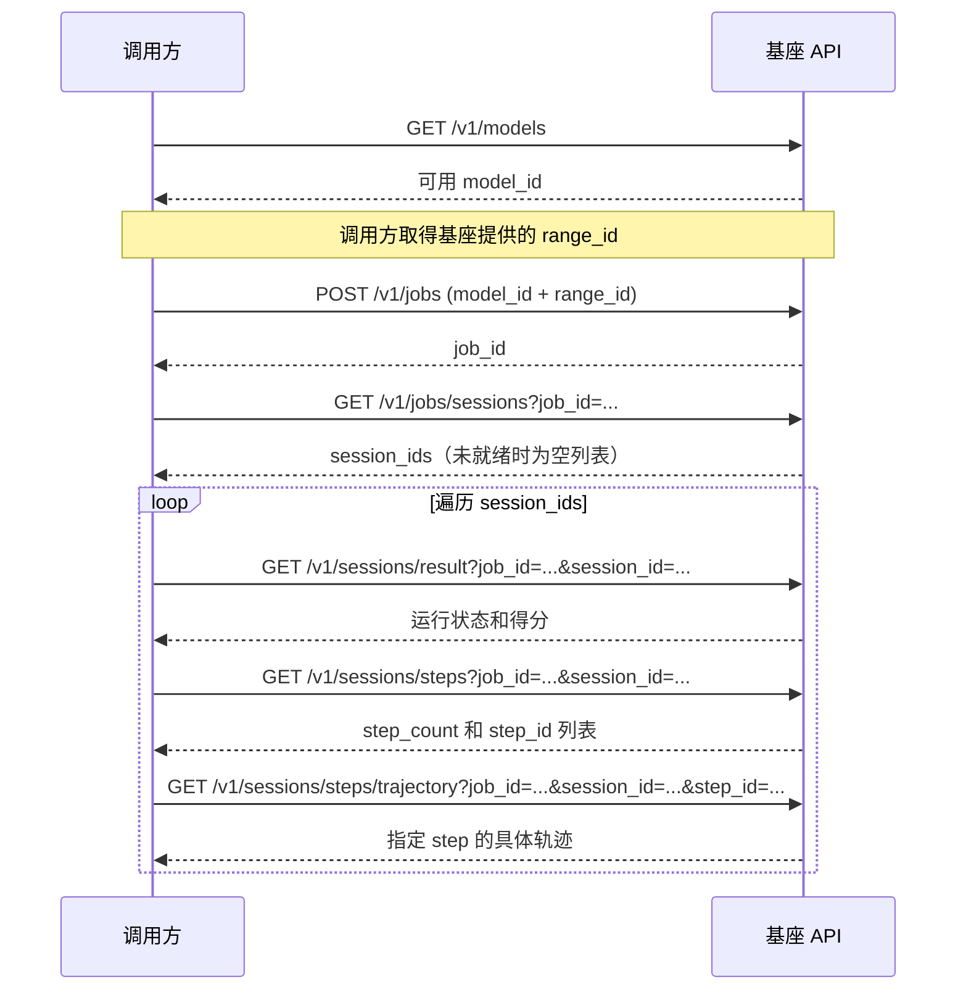

# Safactory Job Server API 设计文档

| 属性 | 内容 |
|---|---|
| API 名称 | Safactory Job API |
| API 版本 | v1 |
| 文档版本 | v2.4 |
| 更新日期 | 2026-08-20 |
| Base Path | `/v1` |

## 1. 设计范围

本文只定义基座与调用方完成一次靶场任务所需的最小接口闭环：

1. 查询基座支持的模型；
2. 使用 `model_id` 和 `range_id` 创建 Job；
3. 使用 `job_id` 查询 `session_id` 列表；
4. 使用 `job_id` 和列表中的 `session_id` 查询运行结果（得分）；
5. 使用 `job_id` 和列表中的 `session_id` 查询轨迹 step 数及 `step_id`；
6. 使用 `job_id`、`session_id` 和 `step_id` 查询某一步的具体轨迹。

不在本文中定义 Job 列表、Task、暂停、恢复、取消、删除、Artifact、日志、事件推送和靶场模板管理接口。

### 1.1 核心约束

- 一个 Job 只运行一个靶场；
- 当前靶场为单页面、单拓扑，一个 Job 可对应一个或多个 Session；
- `range_id` 由基座提供，其值必须与工程中心保存的靶场模板 ID 对齐；
- 模型信息来自 `initialization.yaml` 中 `gateway.config.llm_routes`；route 名称直接作为 `model_id` 和 `name` 返回；
- `model_id` 必须来自模型查询接口，且创建 Job 时仍处于可用状态；
- ID 均为不透明字符串，调用方不得解析或自行拼接 ID；
- 创建 Job 后的所有查询都必须携带 `job_id`，服务端必须校验 Session、Step 与 Job 的归属关系；
- Job 异步运行，`session_id` 列表、得分和轨迹均可能暂未生成，调用方应按本文约定轮询。

## 2. 调用流程



接口总览：

| 顺序 | Method | Path | 用途 |
|---:|---|---|---|
| 1 | GET | `/v1/models` | 查询基座支持的模型 |
| 2 | POST | `/v1/jobs` | 选择模型和靶场并创建 Job |
| 3 | GET | `/v1/jobs/sessions` | 使用 query 参数 `job_id` 查询 Session ID 列表 |
| 4 | GET | `/v1/sessions/result` | 使用 query 参数 `job_id`、`session_id` 查询运行结果（得分） |
| 5 | GET | `/v1/sessions/steps` | 使用 query 参数 `job_id`、`session_id` 查询轨迹 step 数和 Step ID |
| 6 | GET | `/v1/sessions/steps/trajectory` | 使用 query 参数 `job_id`、`session_id`、`step_id` 查询某一步具体轨迹 |

## 3. 通用约定

### 3.1 协议与数据格式

- 使用 HTTPS；
- 请求和响应使用 `application/json; charset=utf-8`；
- 字段名使用 `snake_case`；
- 时间使用 UTC RFC 3339，例如 `2026-08-17T08:30:00Z`；
- API 路径使用固定资源路径，不得将 `job_id`、`session_id`、`step_id` 等可变参数编码为路径片段；
- `job_id`、`session_id`、`step_id` 统一通过 query 参数传递，其值必须进行 URL 编码；
- 必需的 query 参数缺失或为空时，返回 `400 INVALID_REQUEST`。

### 3.2 错误响应

所有接口使用统一错误结构：

```json
{
  "error": {
    "code": "MODEL_NOT_AVAILABLE",
    "message": "The selected model is not available.",
    "details": {
      "model_id": "kimi-k3"
    },
    "retryable": false
  },
  "request_id": "req_01K..."
}
```

客户端逻辑应依赖稳定的 `error.code`，不得依赖 `message` 文案。

### 3.3 通用状态码

| HTTP 状态码 | 说明 |
|---:|---|
| 200 | 查询成功 |
| 202 | Job 创建请求已接受 |
| 400 | 请求格式或参数格式错误 |
| 404 | 指定资源不存在 |
| 409 | 资源存在，但依赖数据尚未就绪或状态冲突 |
| 422 | `model_id` 或 `range_id` 无效 |
| 500 | 未分类的服务端错误 |
| 503 | 工程中心、执行引擎或存储暂不可用 |

## 4. 查询基座支持的模型

### `GET /v1/models`

创建 Job 前必须先调用此接口。真实模式直接读取统一初始化 YAML 的
`gateway.config.llm_routes`，每个 route 的键就是可用于新 Job 的模型 ID。

每个模型条目只返回 `model_id` 和 `name`，两者都等于 route 名称。route 的
`base_url`、`api_key` 和其他内部字段不得出现在响应中。

### Response

```http
HTTP/1.1 200 OK
```

```json
{
  "items": [
    {
      "model_id": "kimi-k3",
      "name": "kimi-k3"
    },
    {
      "model_id": "qwen-max",
      "name": "qwen-max"
    }
  ]
}
```

字段说明：

| 字段 | 类型 | 必有 | 说明 |
|---|---|---:|---|
| `items` | array | 是 | 当前可用于创建 Job 的模型列表 |
| `items[].model_id` | string | 是 | 创建 Job 时使用的模型 ID |
| `items[].name` | string | 是 | 模型展示名称 |

约束：

- `llm_routes` 的 route 名称必须非空且天然唯一；
- 接口返回 `llm_routes` 中的全部 route 名称，不返回 route value；
- Gateway config 缺失、为空或校验失败时，真实模式拒绝启动；
- 模型列表可能发生变化。创建 Job 时，服务端必须从同一 `llm_routes` 再次校验 `model_id`。

## 5. 创建 Job

### `POST /v1/jobs`

使用选中的模型和靶场创建异步 Job。

### Request

```json
{
  "model_id": "kimi-k3",
  "range_id": "range_web_001"
}
```

字段说明：

| 字段 | 类型 | 必需 | 说明 |
|---|---|---:|---|
| `model_id` | string | 是 | 来自 `GET /v1/models` 的模型 ID |
| `range_id` | string | 是 | 基座提供的靶场 ID，必须与工程中心的靶场模板 ID 对齐 |

服务端必须完成以下校验：

- `model_id` 存在且当前可用；
- `range_id` 能在工程中心唯一匹配一个可用的靶场模板；
- 模型和 Range 分别校验，不维护或检查模型与 Range 的组合白名单。

### Response

```http
HTTP/1.1 202 Accepted
Location: /v1/jobs/sessions?job_id=job_01K2XYZ...
```

```json
{
  "job_id": "job_01K2XYZ...",
  "status": "queued",
  "model_id": "kimi-k3",
  "range_id": "range_web_001",
  "created_at": "2026-08-17T08:00:00Z"
}
```

创建响应只保证 Job 已被接受，不保证 Session 已经创建。调用方应使用返回的 `job_id` 查询 `session_id` 列表。

### 主要错误码

| Error code | HTTP | 说明 |
|---|---:|---|
| `MODEL_NOT_FOUND` | 422 | `model_id` 不存在 |
| `MODEL_NOT_AVAILABLE` | 422 | 模型当前不可用于新 Job |
| `RANGE_NOT_FOUND` | 422 | `range_id` 无法匹配工程中心靶场模板 |
| `RANGE_NOT_AVAILABLE` | 422 | 靶场模板当前不可用 |
| `DEPENDENCY_UNAVAILABLE` | 503 | 模型配置、工程中心或执行依赖暂不可用 |

## 6. 使用 Job ID 查询 Session ID 列表

### `GET /v1/jobs/sessions`

查询当前 Job 关联的 Session ID 列表。由于 Job 异步启动，接口可能在 Session 创建前被调用。

### Query parameters

| 参数 | 类型 | 必需 | 说明 |
|---|---|---:|---|
| `job_id` | string | 是 | Job ID |

请求示例：

```http
GET /v1/jobs/sessions?job_id=job_01K2XYZ... HTTP/1.1
```

### Response：Session ID 列表为空

```http
HTTP/1.1 200 OK
Retry-After: 2
```

```json
{
  "job_id": "job_01K2XYZ...",
  "job_status": "preparing",
  "session_ids": []
}
```

### Response：Session ID 列表非空

```http
HTTP/1.1 200 OK
```

```json
{
  "job_id": "job_01K2XYZ...",
  "job_status": "running",
  "session_ids": [
    "session_01K3ABC...",
    "session_01K3DEF..."
  ]
}
```

字段说明：

| 字段 | 类型 | 必有 | 说明 |
|---|---|---:|---|
| `job_id` | string | 是 | Job ID |
| `job_status` | string | 是 | `queued`、`preparing`、`running`、`succeeded` 或 `failed` |
| `session_ids` | array | 是 | 当前 Job 关联的 Session ID 字符串列表；尚未创建或创建失败时为空列表 |
| `error` | object | 否 | `job_status=failed` 时的失败原因 |

约束：

- `session_ids` 为空且 Job 未失败时，调用方可根据 `Retry-After` 继续轮询；
- 同一个 `job_id` 可返回多个 Session ID，列表中不得包含重复项；
- Job 进入终态前，`session_ids` 可追加新值，但已返回的 Session ID 不得变更或移除；Job 进入终态后，列表不得再变更；
- Job 不存在时返回 `404 JOB_NOT_FOUND`。

## 7. 使用 Session ID 查询结果（得分）

### `GET /v1/sessions/result`

查询指定 Job 下 Session 的运行状态和得分。该接口可以在运行中调用。

### Query parameters

| 参数 | 类型 | 必需 | 说明 |
|---|---|---:|---|
| `job_id` | string | 是 | Job ID |
| `session_id` | string | 是 | Session ID，且必须属于指定 Job |

请求示例：

```http
GET /v1/sessions/result?job_id=job_01K2XYZ...&session_id=session_01K3ABC... HTTP/1.1
```

### Response：结果尚未就绪

```http
HTTP/1.1 200 OK
Retry-After: 2
```

```json
{
  "session_id": "session_01K3ABC...",
  "result_status": "running",
  "score": null,
  "completed_at": null
}
```

### Response：结果已完成

```http
HTTP/1.1 200 OK
```

```json
{
  "session_id": "session_01K3ABC...",
  "result_status": "succeeded",
  "score": 8.5,
  "completed_at": "2026-08-17T08:04:10Z"
}
```

字段说明：

| 字段 | 类型 | 必有 | 说明 |
|---|---|---:|---|
| `session_id` | string | 是 | Session ID |
| `result_status` | string | 是 | `pending`、`running`、`succeeded` 或 `failed` |
| `score` | number/null | 是 | 最终得分；结果未完成或失败时为 `null` |
| `completed_at` | string/null | 是 | 结果完成时间 |
| `error` | object | 否 | `result_status=failed` 时的失败原因 |

Job 不存在时返回 `404 JOB_NOT_FOUND`。Session 不存在或不属于指定 Job 时返回 `404 SESSION_NOT_FOUND`。结果尚未完成时返回 200 和空得分，调用方可根据 `Retry-After` 继续轮询。

## 8. 使用 Session ID 查询轨迹 step

### `GET /v1/sessions/steps`

在查询具体轨迹前，先调用此接口取得指定 Job 下 Session 的当前 step 数和可用的 `step_id`。

### Query parameters

| 参数 | 类型 | 必需 | 说明 |
|---|---|---:|---|
| `job_id` | string | 是 | Job ID |
| `session_id` | string | 是 | Session ID，且必须属于指定 Job |

请求示例：

```http
GET /v1/sessions/steps?job_id=job_01K2XYZ...&session_id=session_01K3ABC... HTTP/1.1
```

### Response

```http
HTTP/1.1 200 OK
```

```json
{
  "session_id": "session_01K3ABC...",
  "step_count": 3,
  "sealed": false,
  "steps": [
    {
      "step_id": "step_001",
      "sequence_no": 1
    },
    {
      "step_id": "step_002",
      "sequence_no": 2
    },
    {
      "step_id": "step_003",
      "sequence_no": 3
    }
  ]
}
```

字段说明：

| 字段 | 类型 | 必有 | 说明 |
|---|---|---:|---|
| `session_id` | string | 是 | Session ID |
| `step_count` | integer | 是 | 当前已持久化、可查询的 step 数，等于 `steps` 数组长度 |
| `sealed` | boolean | 是 | 轨迹是否已结束且不会再增加 step |
| `steps` | array | 是 | 按 `sequence_no` 升序返回的 Step 索引 |
| `steps[].step_id` | string | 是 | 查询具体轨迹时使用的 Step ID |
| `steps[].sequence_no` | integer | 是 | 从 1 开始的展示顺序 |

约束：

- Session 运行中允许返回 `step_count=0` 和空 `steps`；
- `sealed=false` 表示后续查询可能得到更多 step；
- `sealed=true` 表示轨迹已经完整；
- 已返回的 `step_id` 及其 `sequence_no` 不得变化或被复用；
- Job 不存在时返回 `404 JOB_NOT_FOUND`；Session 不存在或不属于指定 Job 时返回 `404 SESSION_NOT_FOUND`。

## 9. 使用 Session ID 和 Step ID 查询具体轨迹

### `GET /v1/sessions/steps/trajectory`

返回指定 Job 下 Session 中某一步的具体轨迹。`job_id`、`session_id` 和 `step_id` 必须同时参与查询和归属校验。

### Query parameters

| 参数 | 类型 | 必需 | 说明 |
|---|---|---:|---|
| `job_id` | string | 是 | Job ID |
| `session_id` | string | 是 | Session ID，且必须属于指定 Job |
| `step_id` | string | 是 | Step ID，且必须属于指定 Session |

请求示例：

```http
GET /v1/sessions/steps/trajectory?job_id=job_01K2XYZ...&session_id=session_01K3ABC...&step_id=step_002 HTTP/1.1
```

### Response

```http
HTTP/1.1 200 OK
```

```json
{
  "session_id": "session_01K3ABC...",
  "step_id": "step_002",
  "sequence_no": 2,
  "started_at": "2026-08-17T08:01:12Z",
  "finished_at": "2026-08-17T08:01:18Z",
  "trajectory": {
    "model_input": {
      "messages": []
    },
    "model_output": {
      "content": "...",
      "tool_calls": []
    },
    "action": {},
    "observation": {}
  }
}
```

字段说明：

| 字段 | 类型 | 必有 | 说明 |
|---|---|---:|---|
| `session_id` | string | 是 | Session ID |
| `step_id` | string | 是 | Step ID |
| `sequence_no` | integer | 是 | Step 在 Session 中的顺序 |
| `started_at` | string/null | 是 | Step 开始时间 |
| `finished_at` | string/null | 是 | Step 完成时间 |
| `trajectory` | object | 是 | 归一化后的该步轨迹内容 |
| `trajectory.model_input` | object/null | 否 | 本步模型输入 |
| `trajectory.model_output` | object/null | 否 | 本步模型输出 |
| `trajectory.action` | object/null | 否 | 本步执行的动作或工具调用 |
| `trajectory.observation` | object/null | 否 | 动作执行后的环境反馈 |

服务端必须过滤密钥、鉴权信息、宿主机路径等敏感数据。不存在的 `job_id` 返回 `404 JOB_NOT_FOUND`；`session_id` 不存在或不属于指定 Job 时返回 `404 SESSION_NOT_FOUND`；`step_id` 不存在或不属于该 Session 时统一返回 `404 STEP_NOT_FOUND`，不得返回其他 Job 或 Session 的轨迹。

## 10. 稳定错误码

| Error code | HTTP | Retryable | 说明 |
|---|---:|---:|---|
| `INVALID_REQUEST` | 400 | 否 | 请求格式或参数格式错误 |
| `MODEL_NOT_FOUND` | 422 | 否 | 模型不存在 |
| `MODEL_NOT_AVAILABLE` | 422 | 否 | 模型当前不可用 |
| `RANGE_NOT_FOUND` | 422 | 否 | 靶场 ID 无法匹配工程中心模板 |
| `RANGE_NOT_AVAILABLE` | 422 | 视情况 | 靶场模板当前不可用 |
| `JOB_NOT_FOUND` | 404 | 否 | Job 不存在 |
| `SESSION_NOT_FOUND` | 404 | 否 | Session 不存在或不属于指定 Job |
| `STEP_NOT_FOUND` | 404 | 否 | Step 不存在或不属于指定 Session |
| `DEPENDENCY_UNAVAILABLE` | 503 | 是 | 模型配置、工程中心、执行引擎或存储暂不可用 |
| `INTERNAL_ERROR` | 500 | 是 | 未分类的服务端错误 |

## 11. 闭环验收标准

使用一组有效的 `model_id` 和 `range_id`，调用方必须能够完成以下流程：

1. 从模型接口取得 `model_id`；
2. 创建 Job 并取得 `job_id`；
3. 轮询 Job 的 Session 列表接口，取得 `session_ids` 列表；
4. 对列表中的每个 `session_id`，使用 `job_id + session_id` 查询运行结果并在完成后取得得分；
5. 对列表中的每个 `session_id`，使用 `job_id + session_id` 查询 `step_count` 和全部可用 `step_id`；
6. 对每个 `step_id`，使用 `job_id + session_id + step_id` 查询对应的具体轨迹；
7. 对每个 Session，当 `sealed=true` 时，已查询到的 step 数量必须等于 `step_count`，且每个 Step 均可获取唯一的轨迹详情。
