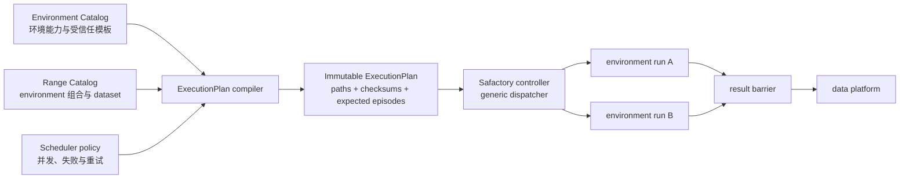

# Safactory Job Server 代码与设计审查

| 属性 | 内容 |
|---|---|
| 审查日期 | 2026-08-26 |
| 对外契约基线 | `API_DESIGN.md` v2.5 / API v1 Frozen |
| 代码基线 | `35742bc`（含工作区已有文档修改） |
| 自动化基线 | Ruff 通过；Pytest 42 passed |

## 1. 结论

六个公开 API 的 handler、schema、认证、Job owner 隔离和主要错误响应已经形成可运行闭环，
可以冻结 v1 接口形状；但真实调度还不能按 PRD 宣称支持“一个 Range 包含多个环境”。当前
`SharedFileManager` 明确拒绝多 environment group，controller 命令也只能传一个
`--agent-start-config`。

最终调度必须收敛为：**Environment Catalog 注册环境，Range Catalog 组合环境，Server 编译
不可变 ExecutionPlan，controller 按配置策略调度**。外部 API 仍只接收
`model_id + range_id`，不暴露 image、命令、mount 或凭据。

## 2. 当前问题清单

### P0：上线或目标架构阻断

| 问题 | 当前证据 | 影响 | 收敛要求 |
|---|---|---|---|
| 多环境设计与实现相反 | `file_manager.py` 在 `len(groups) != 1` 时直接失败；`orchestrator.py` 只生成一个 `--agent-start-config` | PRD 的多环境、总 episode 数和分组调度不可达 | controller 增加 execution-plan/manifest 入口，或使用通用 dispatcher 按 plan 为每个环境调用 launcher |
| 敏感数据形成明文快照 | 模型 route（含 API Key）写入 `model_gateway_json`，完整 Gateway config 又写入共享盘 `gateway.yaml` | Control DB、共享盘备份或误配权限会暴露模型和数据平台凭据 | 快照只保存 Secret 引用和非敏感 checksum；凭据在 RJob 提交时由 Secret provider 注入，不落 binding 和事件 |
| 轨迹脱敏不足以满足冻结契约 | 当前只按少量“精确 key”递归替换，`x-api-key`、嵌套 headers、任意 `path/cwd` 等仍可能返回 | API 文档承诺过滤密钥与宿主机路径，存在真实数据泄漏风险 | 采用结构化 allowlist 输出；对 headers、URL userinfo、路径和常见 credential key 做统一 sanitizer，并增加攻击样例测试 |
| RJob 幂等命中未校验身份 | BrainPP adapter 发现同名 Job 后直接复用，不核对 `job_id/component` label、image 或 spec digest | 同名陈旧/冲突 RJob 可能被绑定到新 Job，产生串任务或错误结果 | 持久化并校验 spec digest；同名但 label/digest 不符必须报冲突，不能静默复用 |

### P1：可靠性与一致性缺口

| 问题 | 当前表现 | 建议 |
|---|---|---|
| `202 Accepted` 与模板有效性边界不一致 | POST 只校验 Range 条目存在；dataset/start config/mount 到后台 binding 才校验，错误 Job 仍先返回 202 | 启动预检校验全 Catalog；创建时解析并保存 ExecutionPlan，计划无效返回 `RANGE_NOT_AVAILABLE`，仅平台提交保持异步 |
| “不可变 binding”没有完整性复核 | 已存在 `.binding.json` 时直接返回，不重新校验快照文件和 checksum | 恢复/提交前校验 plan 与全部文件 checksum；发布目录改只读并记录 catalog version |
| 数据平台 preflight 不访问数据平台 | client 只要存在 `query_data` 方法就直接通过 preflight | 执行只读 health/schema probe，验证目标表、必需列、认证和超时 |
| 结果 barrier 证据不足 | BrainPP snapshot 通常没有 `workload_summary`；为空时 `_results_complete()` 直接返回 true | controller 生成带 plan checksum、expected/collected/failed 的签名 summary；Server 对 summary 和结果文件做 barrier 校验 |
| Gateway 单次抖动导致整个 Job 失败 | controller 运行后任一次 health check 失败即 `GATEWAY_LOST_DURING_RUN` | 增加连续失败阈值、退避和 grace period；RJob 终态仍可立即失败 |
| 失败状态不是稳定领域模型 | `status_reason` 直接成为 `jobs/sessions.error.code`，但这些值未在 API 文档冻结 | 对外统一为稳定的 `JOB_EXECUTION_FAILED`，内部 reason 放入受控 details 或仅保留在审计事件 |
| 自动生成的 OpenAPI 与冻结文档不一致 | 认证由 middleware 实现，OpenAPI 没有 Bearer security scheme；handler 也没有声明统一 400/403/404/503 response | 由 schema/依赖显式注册 security scheme 和错误响应，并增加 OpenAPI snapshot contract test |
| environment 级状态不可恢复 | Control DB 只有两个顶层 RJob 和 episode 聚合计数 | 增加 environment run/attempt 状态表或持久化 controller plan state，支持每组重试、恢复和审计 |
| 两级并发没有统一预算 | launcher 的 pool/max-workers 与未来 environment 并发独立配置 | 编译计划时计算 environment 并发 × episode 并发，超过集群/Range 上限则拒绝计划 |
| SQLite 只适合单实例 writer | 进程内 lock 不能协调多副本，乐观锁冲突会进入通用编排失败 | MVP 明确强制单实例并加启动租约；需要 HA 时迁移到支持行锁/lease 的数据库 |
| 真实集成证据不足 | 42 个测试通过，但 RJob、Gateway、launcher 和数据平台均以 fake 为主 | 增加固定镜像 digest 的 staging contract test，至少覆盖一次 Gateway ready、一个环境 run、结果 barrier 和重启恢复 |

### P2：API 可演进性与运维问题

- Session 和 step 列表无分页或上限，大任务会导致无界响应；v1 已冻结，需先设置服务端硬上限，分页接口放入 v2。
- POST 没有幂等请求键，客户端网络重试会创建两个 Job；保持 v1 行为不变，在 v2 设计
  `Idempotency-Key`。
- `SessionResultResponse` 声明可选 `error`，领域对象却没有失败详情，失败 Session 只能返回
  `result_status=failed`；应补齐稳定失败语义或从 v1 文档中明确该字段的来源。
- landing adapter 将同一条 `created_at` 同时映射为 step 的 `started_at/finished_at`，时间语义并不真实；
  数据平台需要提供明确的开始/结束字段。
- 环境目录复制采用排除列表，新增的大型 runtime、日志或秘密文件可能被意外打包；应改成
  manifest allowlist。
- Range Catalog 热读取、模型配置仅启动时读取，两类配置的刷新语义不同；应统一为带版本的
  原子发布和显式 reload 策略。

## 3. 目标 env 调度模型

职责边界：

- Environment Catalog 决定“环境怎么运行”，包括受信任 adapter 和配置文件；
- Range Catalog 决定“这次靶场运行哪些环境和数据”；
- scheduler policy 决定“这些环境按什么并发、失败和重试策略运行”；
- ExecutionPlan 是唯一运行输入，Job 创建后不可随 Catalog 变化；
- controller 只实现通用 plan 调度和 adapter allowlist，不感知 cyberrange、harbor 等具体名称；
- API 查询继续按 `job_id/session_id/step_id` 从数据平台读取，不因内部多环境而改变。

具体 YAML 和字段约束以 `PRD.md` 9.2 为准。

## 4. 推荐落地顺序

1. **安全与真实性**：Secret 引用化、轨迹 allowlist 脱敏、RJob spec digest 校验、真实数据平台 preflight。
2. **计划编译**：引入 Environment Catalog schema 和 ExecutionPlan，先保持单 environment，替换当前路径直连。
3. **可恢复状态**：持久化 environment run/attempt，加入结果 summary/barrier 和 checksum 复核。
4. **多环境 dispatcher**：controller 支持 manifest，落地并发预算、fail-fast 和环境级重试。
5. **真实验收**：用两个不同 environment 的 staging Range 验证并行/串行、部分失败、重启恢复和结果完整性。

## 5. 验收条件

- 新增环境只修改受信任 Catalog/YAML，不修改 Job Server 或 controller 的环境名称分支；
- 一个 Range 可配置两个不同环境，两个 start config 均被准确使用；
- ExecutionPlan 与所有输入都有 checksum，Catalog 更新不影响已创建 Job；
- environment 并发、episode 并发、失败策略和重试次数全部由配置决定并经过上限校验；
- controller 或 Server 重启后不会重复已成功 run，也不会把缺少结果的 run 判为成功；
- API v1 的六个 Method/Path、请求和响应契约保持不变；
- Secret 不进入 Control DB、binding、共享输入快照、事件或公开 trajectory；
- 除单元/契约测试外，至少有一条真实 staging 多环境 E2E 通过。
