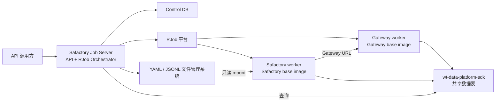
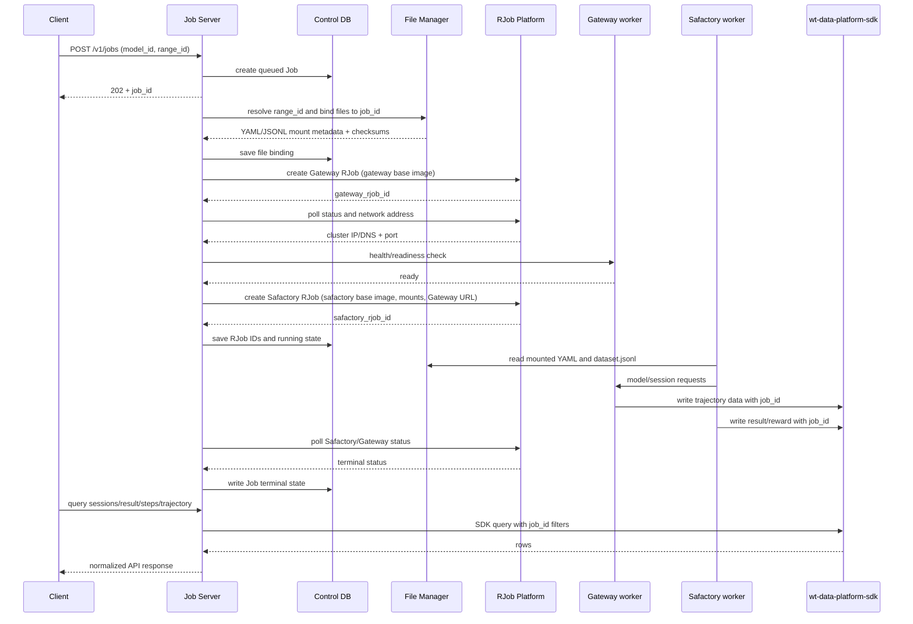

# Safactory Job Server 产品需求文档（PRD）

| 属性 | 内容 |
|---|---|
| 产品名称 | Safactory Job Server |
| 文档版本 | v2.0 |
| 文档状态 | Draft for Review |
| 更新日期 | 2026-08-20 |
| 目标版本 | MVP / v1 |

## 1. 文档目的

本文定义 Safactory Job Server 的产品边界、RJob 调度方式、Gateway 与 Safactory 工作负载的启动顺序、YAML/`dataset.jsonl` 文件管理、运行状态和查询数据链路。

对外接口字段、路径、状态和错误响应以 [API_DESIGN.md](./API_DESIGN.md) 为准。

核心方案：

> 系统提供一个统一的 Job Server，对外实现 API 文档中的全部接口。创建 Job 后，Server 通过 RJob 平台依次从 Gateway base image 和 Safactory base image 创建两个独立工作负载：必须先启动 Gateway 并取得可被 Safactory 访问的网络地址，再启动 Safactory。Safactory 启动所需 YAML 配置和 `dataset.jsonl` 由统一文件管理系统按 `job_id` 解析并以只读 mount 方式注入。运行数据查询统一通过 `wt-data-platform-sdk` 完成。

除特别说明外，本文中的 Job 指 `POST /v1/jobs` 创建的一次靶场任务；“Gateway worker”和“Safactory worker”分别指该 Job 对应的两个 RJob 工作负载。

## 2. 背景与问题

Safactory 基于 YAML 配置和 dataset 文件执行任务，经 Gateway 发起模型请求，生成 Session/trajectory 并把数据写入数据平台。Job Server 提供以下能力：

- 用一个长期运行的 Server 承载 API 文档中的六个接口；
- 将 HTTP 请求与异步 RJob 执行解耦；
- 为每个 Job 创建独立的 Gateway worker 和 Safactory worker；
- 保证 Gateway 先就绪，并将其集群内可访问地址传给 Safactory；
- 统一管理 Safactory 所需 YAML 和 `dataset.jsonl`，建立稳定的 `job_id` 文件映射；
- 在 Server 重启后根据持久化的 RJob ID 恢复任务状态；
- 通过 `wt-data-platform-sdk` 查询 Session、得分和轨迹。

## 3. 产品目标与范围

### 3.1 MVP 目标

1. 部署一个 Safactory Job Server，实现 [API_DESIGN.md](./API_DESIGN.md) 定义的所有接口。
2. 使用 `model_id + range_id` 创建异步 Job，并立即返回 `202 Accepted` 和 `job_id`。
3. Job 调度统一通过 RJob 平台完成，Server 负责提交、轮询和清理 RJob。
4. 提供可被 RJob 拉取的 Gateway base image 和 Safactory base image，并记录实际使用的不可变版本或 digest。
5. 每个 Job 先创建一个 Gateway RJob；仅当 Gateway 地址已取得且健康检查通过后，才创建 Safactory RJob。
6. 创建 Safactory RJob 时，把 `job_id`、模型信息、Gateway URL、YAML 和 `dataset.jsonl` mount 信息传入工作负载。
7. 统一文件管理系统维护 `range_id → 文件模板` 和 `job_id → 已解析文件版本` 的映射。
8. Safactory worker 通过只读 mount 读取 YAML 和 `dataset.jsonl`，按 Safactory CLI/entrypoint 约定运行。
9. Server 持久化 Job 状态、两个 RJob ID、Gateway 地址和文件绑定，重启后可继续轮询和清理。
10. Session、结果和轨迹查询全部通过 `wt-data-platform-sdk` 访问共享数据表，并始终包含 `job_id` 过滤条件。

### 3.2 MVP 范围边界

- 公开 API 范围为 [API_DESIGN.md](./API_DESIGN.md) 定义的六个接口；
- Job 停止仅供超时策略和运维内部使用；
- YAML/JSONL、image、运行命令、mount 和凭据由服务端受信任配置提供；
- 暂停恢复、Session/step 级重试和手动停止不在 MVP 范围内。

## 4. 用户角色与核心场景

### 4.1 用户角色

| 角色 | 主要诉求 |
|---|---|
| API 调用方 | 查询模型、创建 Job、轮询 Session、查询得分与轨迹。 |
| Job Server | 校验请求、持久化 Job、编排两个 RJob、提供查询接口。 |
| 文件管理员 | 维护 `range_id` 对应的 YAML 和 `dataset.jsonl` 模板及版本。 |
| 运维人员 | 查看 RJob 状态、定位启动失败并清理异常工作负载。 |
| 数据平台 | 持久化并提供 Session、step、trajectory 和 reward 查询。 |

### 4.2 正常执行流程

1. 调用方通过 `GET /v1/models` 取得可用 `model_id`，并持有基座提供的 `range_id`。
2. 调用方通过 `POST /v1/jobs` 提交 `model_id + range_id`。
3. Server 校验模型、靶场和文件模板，生成唯一 `job_id`，持久化 `queued` Job 并返回 `202 Accepted`。
4. 后台编排器领取 Job，根据 `range_id` 解析 YAML 和 `dataset.jsonl` 模板，为该 `job_id` 发布不可变文件绑定。
5. Server 使用 Gateway base image 创建 Gateway RJob，并写入 `job_id`、模型路由和运行参数。
6. Server 轮询 Gateway RJob，等待其进入可运行状态，从 RJob 平台取得集群内 IP/DNS 和端口，再执行 Gateway 健康检查。
7. Gateway 就绪后，Server 组合出 Safactory 可访问的 Gateway URL。
8. Server 使用 Safactory base image 创建 Safactory RJob，传入 `job_id`、`model_id`、Gateway URL、YAML/JSONL mount 和 Safactory 启动参数。
9. Safactory worker 从 mount 读取配置与数据集，运行任务；模型请求发往该 Job 的 Gateway。
10. Safactory/Gateway 通过数据写入链路把 Session、step、trajectory 和结果写入 `wt-data-platform-sdk` 管理的共享数据表，记录中包含 `job_id`。
11. Server 持续轮询两个 RJob 的状态；Safactory 成功退出后，Job 进入 `succeeded`，随后按保留策略清理两个 RJob。
12. 调用方通过 API 轮询 Session、得分和轨迹；Server 使用 SDK 按 `job_id` 及相关 Session/step 条件查询并归一化返回。

### 4.3 失败与清理流程

- 文件绑定创建失败时，不创建任何 RJob，Job 直接进入 `failed`。
- Gateway RJob 创建或启动失败时，不得创建 Safactory RJob；Job 进入 `failed` 并清理 Gateway RJob。
- Gateway 已启动但无法取得可路由地址或健康检查失败时，不得创建 Safactory RJob。
- Safactory RJob 创建失败时，Job 进入 `failed`，并清理已创建的 Gateway RJob。
- Safactory 运行期间 Gateway 异常退出时，Server 停止 Safactory RJob，再清理 Gateway RJob，Job 进入 `failed`。
- Safactory 异常退出时，Server 保留已成功写入数据平台的数据，记录错误摘要，并清理 Gateway RJob。
- 清理顺序始终为先 Safactory、后 Gateway，避免 Gateway 先退出导致仍在运行的 Safactory 请求失败或轨迹收尾丢失。
- RJob 删除失败时进入后台清理队列，不得阻塞 API 查询已持久化的数据。

## 5. 核心领域模型

### 5.1 Job

Job 是外部创建和查询的最小任务单元：

- 由不透明的 `job_id` 唯一标识；
- 绑定一个 `model_id` 和一个 `range_id`；
- 绑定一个不可变的 YAML/`dataset.jsonl` 文件版本；
- 最多拥有一个有效 Gateway RJob 和一个有效 Safactory RJob；
- 可以产生一个或多个 Session；
- `job_id` 同时写入 RJob label/env、日志和数据平台记录，用于跨组件关联和数据过滤；
- Job 访问控制由 Server 独立校验。

### 5.2 Gateway worker

Gateway worker 是从 Gateway base image 创建的一个 RJob：

- 必须先于 Safactory worker 创建；
- 接收 `job_id` 和由 `model_id` 解析出的可信模型路由配置；
- 对 Safactory 暴露集群内可访问的 IP/DNS 和端口；
- 必须提供可配置的 readiness/health 检查；
- 一个 Gateway worker 只服务一个 Job；
- 实际 RJob ID、image 版本、地址、端口和状态必须持久化；
- Safactory 退出后才能停止或删除 Gateway worker。

### 5.3 Safactory worker

Safactory worker 是从 Safactory base image 创建的一个 RJob：

- 只能在对应 Gateway worker ready 后创建；
- 启动参数由 Server 生成，不接受调用方提供的任意命令；
- 接收 `job_id`、`model_id`、Gateway URL 和 cloud storage/SDK 运行配置；
- 以只读方式 mount 当前 Job 的 YAML 与 `dataset.jsonl`；
- YAML 中的数据集路径必须指向容器内实际 mount 的 `dataset.jsonl`；
- 按 Safactory CLI/entrypoint 约定启动任务；
- 只连接该 Job 的 Gateway URL；
- 退出码和 RJob 终态转换为稳定的内部 Job 状态和错误分类。

### 5.4 Job 文件集

每个 Job 文件集至少包含：

- 一份 Safactory YAML 配置；
- 一份 `dataset.jsonl`；
- 文件版本、checksum、创建时间和来源 `range_id`；
- 容器内 mount 目录与最终文件路径；
- 可选的模板渲染参数，但不得包含明文密钥。

文件集发布后对该 Job 不可变。需要修改配置时必须创建新 Job 或新的文件版本，不得在运行中原地覆盖。

### 5.5 Session 与 Step

- Session 使用 `session_id`，并通过数据平台记录中的 `job_id` 归属于一个 Job；
- Step 在 Session 内有稳定的 `step_id` 和顺序；
- Server 通过 SDK 查询共享表并按 API 文档归一化返回。

## 6. 总体架构



架构约束：

- RJob 编排是 Job Server 的内部模块。
- Server 只提交、轮询和清理 RJob，不承载 Safactory 或 Gateway 的业务进程。
- 一个 Job 固定创建两个工作负载：一个 Gateway RJob、一个 Safactory RJob。
- 两个 RJob 引用预构建 base image，不在 Job 创建路径上构建 image。
- Gateway ready 和地址发现是创建 Safactory RJob 的硬前置条件。
- YAML/JSONL 必须来自受控文件管理系统，并通过 RJob 可访问的共享存储 mount。
- Server 通过 `wt-data-platform-sdk` 公共接口查询运行数据。

## 7. Base image 与 RJob 规范

### 7.1 Base image 管理

系统配置中至少维护：

| 配置项 | 说明 |
|---|---|
| `gateway_base_image` | Gateway worker 使用的 registry image，生产环境应固定 digest |
| `safactory_base_image` | Safactory worker 使用的 registry image，生产环境应固定 digest |
| `image_pull_policy` | RJob 拉取策略 |
| `gateway_resources` | Gateway 的 CPU、内存及其他资源 |
| `safactory_resources` | Safactory 的 CPU、内存、GPU 及其他资源 |
| `rjob_namespace` | 工作负载所在 namespace |
| `charged_group` | RJob 配额或计费组 |

Image 和资源配置由服务端管理。Server 必须在 Job 记录中保存两个工作负载实际使用的 image 引用。

### 7.2 Gateway RJob 提交

Gateway RJob 至少包含：

- 可幂等重建的 RJob 名称，建议由 `job_id` 派生；
- Gateway base image；
- `job_id` label/env；
- 由 `model_id` 解析的模型路由配置引用；
- listen port 和 health/readiness 配置；
- 资源、超时、日志和自动清理策略；
- 数据平台所需的部署级配置引用。

RJob 创建成功只表示工作负载已提交，不表示 Gateway 可用。Server 必须继续完成地址发现和健康检查。

### 7.3 Gateway 地址发现

Server 必须从 RJob 平台取得 Safactory 容器可访问的网络信息：

- 优先使用平台提供的集群内 DNS/Service 地址；
- 仅在平台明确保证 IP 生命周期和可路由性时使用 Pod/worker IP；
- 地址不得使用 `127.0.0.1` 或 `localhost`；
- Server 使用地址和配置端口组成 Gateway URL；
- Gateway URL 必须通过健康检查后才能传给 Safactory；
- 实际地址、端口、URL 和发现时间必须写入 Job 记录。

### 7.4 Safactory RJob 提交

Safactory RJob 至少包含：

- Safactory base image；
- `job_id`、`model_id` 和已验证的 Gateway URL；
- YAML/`dataset.jsonl` 的 mount 配置；
- Safactory entrypoint/CLI 参数；
- cloud storage 模式及 `wt-data-platform-sdk` 部署级配置；
- 资源、运行超时、日志和自动清理策略。

提交前必须再次确认 Gateway 仍处于 ready 状态。Safactory RJob 创建后，Server 保存 RJob ID 并进入运行状态轮询。

## 8. YAML 与 dataset.jsonl 文件管理

### 8.1 管理目标

后端必须提供统一文件管理能力，使 Job Server 不依赖仓库内临时文件或人工拼接路径。该能力可以是 Server 内部模块，也可以是独立文件服务，但对 Job Server 必须提供稳定的元数据接口。

文件管理系统负责：

1. 维护 `range_id` 对应的 YAML 和 `dataset.jsonl` 模板；
2. 创建 Job 时校验两个文件存在、格式有效且版本兼容；
3. 为 `job_id` 建立不可变文件绑定；
4. 必要时渲染 Job 专属 YAML，使 dataset 路径指向容器内 mount 路径；
5. 将文件发布到 RJob 集群可访问的共享存储；
6. 返回 mount source、target、文件版本和 checksum；
7. 提供按 `job_id` 查询绑定的内部能力，供重启恢复和审计使用。

### 8.2 文件映射

逻辑映射如下：

```text
range_id
  -> yaml_template_version
  -> dataset_version
  -> create job_id binding
       -> rendered config.yaml
       -> dataset.jsonl
       -> mount source / target
       -> checksums
```

推荐把两个文件放在同一个只读 mount 目录，并让 YAML 使用相对 dataset 路径：

```text
<shared-storage>/safactory/jobs/<job_id>/
├── config.yaml
└── dataset.jsonl

容器内：
/mnt/safactory-job/config.yaml
/mnt/safactory-job/dataset.jsonl
```

该目录用于管理 Safactory 启动输入。Session、trajectory 和 score 写入数据平台共享表。

### 8.3 发布与 mount 规则

- mount source 必须位于 RJob 集群可访问的共享存储，不能是 Server 的本地临时路径；
- YAML 和 JSONL 在提交 Safactory RJob 前必须完成 schema/语法校验；
- YAML 中引用的 dataset 路径必须能在容器内解析到已 mount 文件；
- mount 对 Safactory worker 默认只读；
- Job 运行期间文件不得原地修改或删除；
- 文件发布必须原子化，禁止 Safactory 读取到只写入一半的文件；
- 文件版本和 checksum 必须写入 Job 记录；
- 文件中不得写入 RJob AK/SK、模型密钥或数据平台明文凭据；
- 文件保留与清理由统一策略管理，不与 RJob 删除操作绑定。

## 9. 运行数据与 API 查询

### 9.1 数据边界

- 运行数据由 Safactory/Gateway 写入 `wt-data-platform-sdk` 管理的共享 landing/serving 表；
- `job_id` 是共享表中的任务标识和查询条件；
- Control DB 只保存 Job/RJob/文件绑定状态，不保存 trajectory 或 score 副本；
- YAML/JSONL 文件管理系统只保存启动输入，不作为运行结果来源。

### 9.2 API 查询映射

| API 查询 | SDK 查询方式 |
|---|---|
| Job 的 Session ID 列表 | 按精确 `job_id` 查询，并对非空 `session_id` 去重 |
| Session 结果与得分 | 按 `job_id + session_id` 查询完成状态和 reward |
| Session step 列表 | 按 `job_id + session_id` 查询并按 step 顺序排序 |
| 指定 step trajectory | 按 `job_id + session_id + step_id` 精确查询并归一化字段 |

查询要求：

- Server 必须通过 SDK 公共接口查询；
- 每次查询必须包含精确 `job_id` 条件；
- 先校验调用方对 Job 的访问权，再查询共享表；
- Server 独立执行 Job 访问控制和 `job_id` 数据过滤；
- 运行中的 Job 允许暂时返回空 Session 列表、空 step 列表或未完成得分；
- SDK 超时、权限或解码错误必须映射为 API 文档中的稳定错误；
- API 返回前必须过滤密钥、内部地址、mount 路径和 SDK 连接信息。

## 10. 调度与执行时序



## 11. 状态模型

### 11.1 对外 Job 状态

对外状态必须保持 API 文档定义：

| 状态 | 说明 |
|---|---|
| `queued` | Job 已持久化，尚未开始文件解析或 RJob 提交。 |
| `preparing` | 正在绑定文件、启动 Gateway、发现地址或启动 Safactory。 |
| `running` | Safactory RJob 已创建并正在运行。 |
| `succeeded` | Safactory RJob 成功结束。 |
| `failed` | 文件、Gateway、Safactory、RJob 平台或数据依赖失败。 |

### 11.2 内部阶段

`phase` 用于精确定位启动进度：

- `validating_request`
- `resolving_job_files`
- `submitting_gateway_rjob`
- `waiting_gateway_address`
- `checking_gateway_health`
- `submitting_safactory_rjob`
- `running_safactory`
- `stopping_safactory_rjob`
- `stopping_gateway_rjob`
- `cleaning_rjobs`
- `completed`

状态约束：

- Gateway 未 ready 时不得进入 `submitting_safactory_rjob`；
- 只有 Safactory RJob 已创建后才能进入 `running`；
- 终态不可逆；
- RJob 状态未知时不得直接标记成功，应保留可恢复状态并继续对账；
- Job Server 重启后根据 Job phase 和已保存 RJob ID 恢复轮询，不重复创建同角色 RJob。

## 12. Control DB 数据模型要求

### 12.1 `jobs`

至少保存：

- `job_id`、`model_id`、`range_id`；
- public status、internal phase、status reason；
- YAML/JSONL 文件版本、checksum、mount 元数据引用；
- Gateway/Safactory base image 引用；
- `gateway_rjob_id`、`safactory_rjob_id`；
- Gateway IP/DNS、port、URL 和 ready 时间；
- 两个 RJob 的状态、退出码和失败摘要；
- 创建、启动、完成和更新时间；
- 编排 attempt 和乐观锁 version。

不得保存完整 trajectory、模型输入输出或最终 score 副本。

### 12.2 `job_events`

保存以下内部事件：

- Job created；
- files resolved/bound/validation failed；
- Gateway RJob submitted/address discovered/ready/failed/deleted；
- Safactory RJob submitted/running/succeeded/failed/deleted；
- RJob reconciliation started/completed；
- data-platform query failed；
- Job succeeded/failed；
- cleanup requested/completed/failed。

事件用于审计和排障，不作为当前状态的唯一来源。

## 13. 功能需求

### FR-01 API Server

- Server 实现 API 文档定义的模型、创建 Job、Session、结果、step 和 trajectory 接口；
- 创建接口只持久化并排队，不同步等待两个 RJob 启动；
- API 进程不得执行 Safactory 或 Gateway 业务代码；
- 所有响应和错误码遵循 API 文档。

### FR-02 文件解析与绑定

- 根据 `range_id` 唯一解析可用的 YAML 和 `dataset.jsonl` 版本；
- 校验 YAML、JSONL、dataset 引用和 mount 可用性；
- 为 `job_id` 建立不可变绑定；
- 失败时 Job 进入 `failed` 且不创建 Gateway RJob。

### FR-03 Gateway RJob

- 从受信任 Gateway base image 创建；
- 将 `model_id` 转换为服务端可信路由配置；
- 保存 RJob ID 并轮询状态；
- 获取集群可路由地址并完成健康检查；
- 超时或失败时不创建 Safactory RJob。

### FR-04 Safactory RJob

- 仅在 Gateway ready 后从受信任 Safactory base image 创建；
- mount 当前 Job 的 YAML 和 `dataset.jsonl`；
- 注入 `job_id`、Gateway URL、模型和 SDK 配置；
- 保存 RJob ID 并轮询到终态；
- Safactory 成功退出后更新 Job 为 `succeeded`，否则为 `failed`。

### FR-05 查询数据

- 业务查询全部调用 `wt-data-platform-sdk`；
- 所有 SDK 查询包含 `job_id`，并按接口需要增加 `session_id`、`step_id`；
- 数据尚未产生时遵循 API 文档的轮询语义；
- worker 已删除后，已写入数据仍然可查询。

### FR-06 恢复与清理

- Server 重启后扫描非终态 Job；
- 使用已保存的 RJob ID 查询真实状态；
- 若 Gateway 已 ready 但 Safactory 尚未创建，则继续创建 Safactory；
- 若 RJob 已存在，不得因为重启重复创建相同角色工作负载；
- 终态或失败后按顺序清理 Safactory、Gateway；
- 清理必须幂等，并允许后台重试。

## 14. 非功能需求

### 14.1 可用性与一致性

- Server 重启不得丢失已接受 Job；
- Job 状态、RJob ID、文件绑定和 Gateway 地址必须持久化；
- RJob 创建使用可重放的幂等名称或请求键；
- 同一 Job 同一角色最多有一个有效 RJob；
- 文件绑定一旦用于提交 Safactory RJob 就不可修改；
- 终态 Job 不得重新进入运行态。

### 14.2 性能目标

| 指标 | MVP 目标 |
|---|---|
| 创建 Job API P95 | 小于 300 ms，不包含依赖异常重试 |
| 查询接口 API P95 | 小于 500 ms，不包含数据平台异常 |
| Job 创建后状态可见性 | 小于 1 秒 |
| Gateway ready 后提交 Safactory 延迟 | 小于 5 秒 |
| RJob 状态轮询间隔 | 可配置，默认不大于 10 秒 |

模型推理、RJob 排队、image 拉取、YAML/JSONL mount 和靶场运行耗时不计入 API 本身延迟。

### 14.3 安全

- RJob AK/SK、registry 凭据、模型密钥和数据平台 SDK 凭据只由 Server/部署环境管理；
- 调用方只能提交 `model_id + range_id`，不能覆盖 image、命令、mount 或凭据；
- 文件模板和 mount source 必须来自受信任配置；
- Gateway 地址只用于内部编排，不在公开 API 中返回；
- API 查询先做 Job 访问控制，再调用 SDK；
- 日志、事件和错误响应不得包含密钥、完整 mount source 或内部凭据。

### 14.4 可观测性

所有编排日志至少携带：

- `request_id`；
- `job_id`；
- phase；
- orchestrator attempt；
- Gateway/Safactory RJob ID；
- image 引用；
- 耗时和稳定错误分类。

涉及 Session 或 step 的查询日志还应携带对应 ID，但不得记录完整 trajectory。

## 15. 错误分类

| 类别 | 典型错误 | 处理原则 |
|---|---|---|
| 请求与元数据 | 模型不存在、靶场不存在、组合不支持 | 创建失败，不进入调度。 |
| 文件管理 | YAML/JSONL 不存在、格式错误、版本不匹配、mount 不可用 | 不创建 Gateway RJob，Job 失败。 |
| RJob 平台 | 鉴权失败、配额不足、提交失败、状态查询失败 | 有限重试；无法恢复时 Job 失败。 |
| Gateway | image 拉取失败、启动失败、无可路由地址、健康检查失败 | 不创建 Safactory，清理 Gateway。 |
| Safactory | image 拉取失败、mount 失败、配置加载失败、异常退出 | 保留已写数据，清理 Safactory 与 Gateway。 |
| 数据平台 | SDK 查询超时、权限拒绝、数据解码失败 | 查询返回稳定依赖错误，不回退本地结果。 |
| 清理 | RJob 停止/删除失败 | 记录告警并进入幂等清理队列。 |

对外错误必须映射为 API 文档中的稳定错误码，不得泄露 RJob 平台响应、内部 IP、凭据或物理存储路径。

## 16. MVP 验收标准

### 16.1 API 与异步创建

- 六个 API 均由同一个 Server 提供；
- 使用有效 `model_id + range_id` 创建 Job，立即返回 `202` 和唯一 `job_id`；
- HTTP 请求结束后由后台编排器继续执行，不阻塞调用方；
- 无效模型、靶场或文件模板不会创建 RJob。

### 16.2 两个 RJob 的顺序

- 每个 Job 使用 Gateway base image 和 Safactory base image 各创建一个 RJob；
- 可以证明 Gateway RJob 总是先创建；
- Gateway 未取得集群可路由地址或 health 未通过时，Safactory RJob 不会创建；
- Safactory RJob 收到的 Gateway URL 等于 Server 发现并验证的地址；
- 两个 RJob ID、image 和终态均可从 Job 记录审计。

### 16.3 文件管理与 mount

- `range_id` 能解析到一份有效 YAML 和一份 `dataset.jsonl`；
- 创建 Job 后能按 `job_id` 查询对应文件版本、checksum 和 mount 元数据；
- Safactory 容器内能以只读方式读取两个文件；
- YAML 中 dataset 路径正确指向已 mount 的 `dataset.jsonl`；
- Job 运行期间修改模板不会影响该 Job 已绑定的文件；
- mount 失败时 Safactory 明确失败，Gateway 随后被清理。

### 16.4 数据查询闭环

- Safactory/Gateway 写入的每条运行数据都包含正确 `job_id`；
- Session 列表通过 SDK 按 `job_id` 查询得到；
- result 得分通过 SDK 从对应 Session 记录获得；
- step 列表与 trajectory 通过 SDK 按 `job_id + session_id + step_id` 查询得到；
- 删除两个 RJob 后，已写入的数据仍可查询；
- SDK 不可用时返回可诊断错误，不读取本地文件或 Control DB 伪造结果。

### 16.5 故障恢复与清理

- Gateway 失败时不会创建 Safactory；
- Safactory 提交失败时 Gateway 被清理；
- Safactory 运行中 Gateway 失败时两个 RJob 均被清理，Job 失败；
- Server 在 Gateway ready 后、Safactory 提交前重启，恢复后只创建一个 Safactory RJob；
- Server 在两个 RJob 运行期间重启，恢复后继续轮询原 RJob 而不重复创建；
- 清理始终先 Safactory、后 Gateway，并可重复执行。

## 17. 分阶段交付

### Phase 1：最小闭环

- 单一 Job Server 与 Control DB；
- RJob Client 集成；
- 固定版本 Gateway/Safactory base image；
- `range_id → YAML + dataset.jsonl` 文件映射和只读 mount；
- Gateway 先启动、地址发现、health check、Safactory 后启动；
- 六个 API 和 `wt-data-platform-sdk` 查询闭环；
- 基础超时、失败清理和重启恢复。

### Phase 2：生产强化

- Job Server 多副本抢占与幂等编排；
- 文件模板版本管理、审计、原子发布和保留策略；
- image digest 管理、镜像预拉取和资源配额；
- RJob 故障注入、清理队列和告警；
- 完整访问控制和调用审计。

## 18. 风险与决策

| 风险 | 影响 | 决策 |
|---|---|---|
| Gateway 地址发现慢或返回不可路由 IP | Safactory 无法访问 Gateway | 优先使用集群 DNS/Service；必须先 health check，再提交 Safactory。 |
| 两个 RJob 并行创建 | Safactory 启动时没有有效 Gateway URL | 明确串行依赖，Gateway ready 是 Safactory 提交硬门槛。 |
| YAML 与 JSONL 版本不一致 | Safactory 启动或任务执行失败 | 文件管理系统按版本成对发布，并为 Job 保存不可变 binding。 |
| mount 使用 Server 本地路径 | RJob 容器读取不到文件 | mount source 必须位于集群可访问共享存储。 |
| Server 重启导致重复创建 RJob | 同一 Job 重复运行 | 持久化 RJob ID 并使用幂等名称；恢复时先查询后创建。 |
| Gateway 先于 Safactory 被删除 | 运行请求和轨迹收尾失败 | 固定清理顺序：先 Safactory、后 Gateway。 |
| 启动文件与运行结果边界不清 | 数据来源混乱 | YAML/JSONL 只用于启动输入；结果统一通过 SDK 查询。 |
| `job_id` 过滤缺少访问控制 | 共享表数据可能越权 | API 先校验 Job 访问权，再使用精确 `job_id` 条件查询 SDK。 |

## 19. 待确认项

1. Gateway 和 Safactory base image 的 registry 地址、版本策略及 entrypoint 分别是什么？
2. RJob 平台返回的是稳定 DNS/Service，还是 worker IP；对应字段和生命周期如何？
3. Gateway health/readiness endpoint、监听端口和成功判定是什么？
4. YAML 的准确 schema、Safactory 启动命令以及容器内约定路径是什么？
5. `dataset.jsonl` 是按 `range_id` 共享只读版本，还是每个 Job 都需要物化一份快照？
6. 统一文件系统使用哪种 RJob 可访问存储，`mount_config` 的 source 格式是什么？
7. RJob 完成后的保留时长、自动删除策略和失败现场保留策略是什么？
8. Server 重启恢复时，RJob 查询和幂等创建的具体接口能力是什么？
9. 查询 API 统一读取 landing，还是终态后改读 serving；若改读 serving，可接受的发布延迟是多少？
