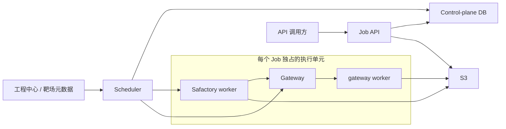
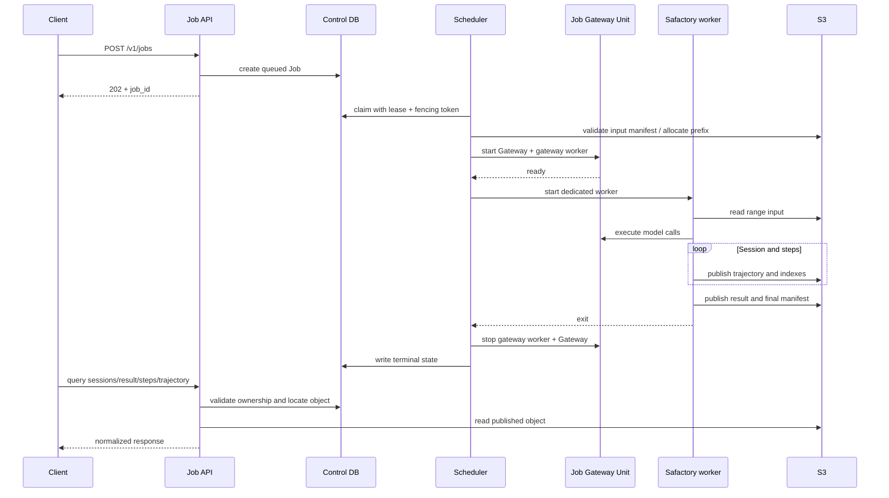
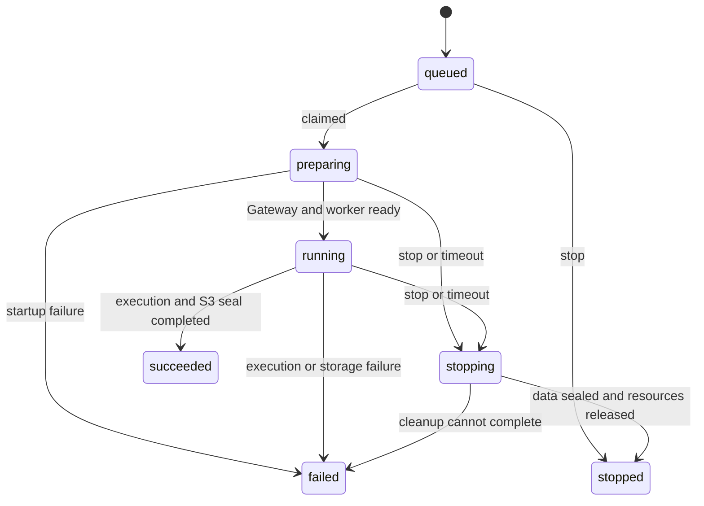

# Safactory Job Server 产品需求文档（PRD）

| 属性 | 内容 |
|---|---|
| 产品名称 | Safactory Job Server |
| 文档版本 | v1.1 |
| 文档状态 | Draft for Review |
| 更新日期 | 2026-08-19 |
| 目标版本 | MVP / v1 |

## 1. 文档目的

本文定义 Safactory Job Server 的产品目标、执行架构、任务调度、任务停止、S3 数据读写约束、状态模型和验收标准。对外接口字段、路径和错误响应以 [API_DESIGN.md](./API_DESIGN.md) 为准，本文不重复定义接口契约。

本版本采用以下核心方案：

> 一个 Job 对应一次独立的 Safactory 靶场任务。每个 Job 独占一套 Gateway 执行单元（Gateway 实例及其 gateway worker）和一个 Safactory worker；任务输入、Session、轨迹、得分和结果统一写入并从 S3 获取，控制面数据库只保存调度状态、资源归属和 S3 对象索引。

除特别说明外，本文中的“任务”指 API 中的 Job，而不是 Job 内部产生的 Session 或 trajectory step。

## 2. 背景与问题

Safactory 已具备靶场执行、模型调用、Session 管理、trajectory 记录和结果评测能力，但要以服务方式提供给外部调用方，还需要补齐以下产品能力：

- 创建请求与长时间运行的任务解耦；
- 对 Job 排队、领取、启动、运行和停止进行持久化调度；
- 为不同 Job 隔离模型路由、Gateway 状态和 Safactory 执行上下文；
- 避免多个任务共享 Gateway 或 worker 时发生配置串扰、轨迹串写和故障扩散；
- 统一运行数据来源，避免 API 分别读取进程内存、本地文件和不同数据库而出现结果不一致；
- 在服务或 worker 异常后识别失联任务并回收孤儿进程；
- 让现有 API 可以稳定查询 Session、得分、step 索引和具体轨迹。

## 3. 产品目标与非目标

### 3.1 MVP 目标

1. 按现有 API 使用 `model_id` 和 `range_id` 创建异步 Job。
2. 通过持久化队列调度 Job，同一 Job 同一时刻只能由一个有效调度实例执行。
3. 每个 Job 启动专属 Gateway 实例和专属 gateway worker，不与其他 Job 共用运行进程或可变配置。
4. 每个 Job 启动专属 Safactory worker，且该 worker 同一时刻只运行该 Job。
5. Safactory worker 通过专属 Gateway 执行模型调用，并可为一个 Job 产生一个或多个 Session。
6. 任务运行所需输入以及产生的 Session、trajectory、结果和得分全部持久化到 S3。
7. 所有运行数据查询以 S3 为唯一业务数据源，不依赖原 worker 或 Gateway 仍然在线。
8. 支持对排队中或运行中的 Job 发出幂等停止命令，并完成进程终止、部分数据封存和资源回收。
9. 通过 lease、heartbeat 和 fencing token 识别 worker 失联并避免重复执行或旧 worker 回写。
10. 提供足够的日志、指标和审计信息定位调度、Gateway、Safactory worker 与 S3 故障。

### 3.2 非目标

以下内容不属于 MVP：

- 一个 Safactory worker 并行运行多个 Job；
- 多个 Job 共享 Gateway、gateway worker 或 warm worker pool；
- 将正在运行的 Job 迁移到另一 Safactory worker 后无损续跑；
- 暂停后保留内存上下文并恢复；
- Session 级或 step 级手动停止、重试和抢占；
- 从 worker 本地磁盘、Gateway 内存或控制面数据库直接返回 trajectory、得分等运行数据；
- 将任意调用方输入直接转换为 shell command、宿主机路径或容器挂载；
- Job 列表、Artifact、日志、事件推送和靶场模板管理等未在当前 API 文档中定义的公开接口；
- 完整的多租户计费和跨集群调度。

## 4. 用户角色与核心场景

### 4.1 用户角色

| 角色 | 主要诉求 |
|---|---|
| 基座调用方 | 创建靶场 Job，轮询 Session，查询得分与轨迹。 |
| 调度服务 | 可靠领取任务，为每个 Job 启动并管理独立执行单元。 |
| 运维人员 | 停止异常任务，查看失败阶段，确认进程和临时凭据已回收。 |
| 管理员 | 管理模型、靶场、并发配额、S3 桶策略和保留周期。 |

### 4.2 正常执行流程

1. 调用方通过模型接口取得可用 `model_id`，并持有基座提供的 `range_id`。
2. 调用方创建 Job，Server 持久化 Job 并返回 `202 Accepted` 和 `job_id`。
3. Scheduler 领取 Job，解析 `range_id` 对应的靶场元数据和 S3 输入位置。
4. Scheduler 为该 Job 创建短期 S3 凭据和独立运行命名空间。
5. Scheduler 启动该 Job 专属 Gateway 及 gateway worker，并等待健康检查通过。
6. Scheduler 启动该 Job 专属 Safactory worker，并将专属 Gateway 地址、模型配置、S3 输入输出位置传给 worker。
7. Safactory worker 从 S3 读取任务输入，运行任务并将 Session、step、trajectory 和结果持续写入 S3。
8. API 根据控制面中的归属与 S3 key，从 S3 返回当前已可见的数据；运行中允许返回空列表或未完成状态。
9. Job 完成后，Safactory worker 封存数据；Scheduler 按顺序停止 Safactory worker、gateway worker 和 Gateway，并写入终态。

### 4.3 停止流程

1. 内部控制面、超时策略或运维操作发出 Job 停止命令。
2. 系统持久化 `stop_requested_at` 和停止原因；重复命令不得产生第二次停止流程。
3. 排队中的 Job 直接停止，不再启动任何执行进程。
4. 运行中的 Job 先停止创建新 Session，再通知 Safactory worker 协作式退出。
5. Safactory worker 在宽限期内结束当前可安全结束的写入，并为已有数据写入部分完成或停止标记。
6. 宽限期结束后仍未退出时，Scheduler 依次执行 `SIGTERM` 和强制终止。
7. Safactory worker 退出后再停止 gateway worker 和 Gateway，避免先断开 Gateway 导致轨迹收尾丢失。
8. 系统检查并封存 S3 索引、回收临时凭据和孤儿进程，最终进入 `stopped`。

当前 [API_DESIGN.md](./API_DESIGN.md) 明确不包含公开停止接口。因此 MVP 必须先具备内部停止能力；若调用方需要通过 HTTP 主动停止 Job，必须在 API 文档中另行补充接口、鉴权、状态和错误码后才能对外开放。

## 5. 核心领域模型

### 5.1 Job

Job 是外部创建、调度、停止、隔离和资源核算的最小单元：

- 由不透明的 `job_id` 唯一标识；
- 绑定一个 `model_id` 和一个 `range_id`；
- 对应一次 Safactory 运行；
- 独占一个 Gateway 执行单元和一个 Safactory worker；
- 拥有独立 S3 前缀、临时凭据和日志关联信息；
- 可以产生一个或多个 Session；
- 终态后不再增加 Session，已封存 Session 不再增加 step。

### 5.2 Gateway 执行单元

每个 Job 必须创建独立 Gateway 执行单元，至少包含：

- 一个只服务于该 Job 的 Gateway 实例；
- 一个使用该 Job 模型路由配置的 gateway worker；
- 独立监听地址或服务发现标识；
- 独立配置快照和进程标识；
- 只允许该 Job 的 Safactory worker 访问的鉴权信息；
- 健康检查、heartbeat 和退出状态。

Gateway 执行单元不得复用其他 Job 的进程内可变配置。实现可以使用本地子进程、容器或编排平台 Pod，但必须满足同等隔离和生命周期语义。

### 5.3 Safactory worker

每个 Job 必须创建一个独立 Safactory worker：

- worker 启动参数由 Scheduler 生成，不接受调用方提供的任意命令；
- worker 只处理传入的 `job_id`；
- worker 只连接该 Job 专属 Gateway；
- worker 只读取授权的 S3 输入前缀，并只写入该 Job 的 S3 输出前缀；
- worker 负责启动 Safactory `SimulationFlow`、生成 Session、运行评测并持久化数据；
- worker 必须周期性 heartbeat，并响应协作式停止信号；
- worker 退出码和退出原因必须转换为稳定的内部错误分类。

### 5.4 Session

Session 是 Job 中一次实际运行会话：

- 使用不透明的 `session_id`；
- 必须唯一归属于一个 `job_id`；
- 包含零个或多个按顺序增长的 step；
- 拥有独立结果、得分、轨迹索引和封存状态；
- Session 失败不应删除已成功持久化的 step。

### 5.5 Step

Step 是 Session 中可查询的最小轨迹单元：

- 使用不透明且在 Session 内唯一的 `step_id`；
- 具有从 1 开始、只增不改的 `sequence_no`；
- 轨迹内容包括归一化后的模型输入、模型输出、action 和 observation；
- 一旦出现在已发布的 step 索引中，其 ID、顺序和对象内容不得被覆盖为另一条轨迹。

### 5.6 控制数据与运行数据

| 数据类别 | 示例 | 真相源 |
|---|---|---|
| 控制数据 | Job 状态、phase、lease、fencing token、进程 ID、停止标志、S3 key | Control-plane DB |
| 运行输入 | 靶场数据、任务输入、执行所需数据快照 | S3 |
| 运行输出 | Session 索引、step 索引、trajectory、得分、结果、完成清单 | S3 |
| 诊断数据 | 结构化日志、指标、进程退出原因 | 日志/监控系统，关键摘要回写 Control-plane DB |

控制面数据库不得保存一份可被 API 当作最终结果返回的 trajectory 或 score 副本，以免形成双重真相源。

## 6. 总体架构



架构约束：

- API 请求线程不得直接运行 Safactory 或启动长时间任务；
- Scheduler 只负责控制面决策和执行单元生命周期，不代理 trajectory 或结果数据；
- 一个 Job 对应一个执行单元；执行单元中的 Gateway、gateway worker 和 Safactory worker 不与其他 Job 共享；
- 调度 Job 前必须同时预留 Gateway 单元与 Safactory worker 所需资源，避免只启动一半后长期占用；
- Safactory worker 与 gateway worker 的全部业务输出必须进入同一 Job 的 S3 命名空间；
- API 查询先校验 `job_id`、`session_id`、`step_id` 的归属，再读取对应 S3 对象；
- Control-plane DB 是调度状态真相源，S3 是任务输入和运行数据真相源，两者通过 `job_id` 关联。

## 7. S3 数据规范

### 7.1 数据源唯一性

运行期和查询期必须遵守以下规则：

- 靶场实际运行数据统一从 S3 获取；工程中心可以提供 `range_id` 对应的元数据和 S3 定位信息，但不得向 worker 直接返回另一份运行数据；
- Safactory worker 不得把本地临时文件作为完成依据，写入 S3 并成功发布索引后才视为数据可查询；
- Gateway 或 gateway worker 如产生轨迹中间数据，也必须写入该 Job 的 S3 前缀；
- API 不得通过 RPC 向仍在运行的 worker 临时拉取结果；
- 本地磁盘只允许保存可删除的临时文件，Job 完成或停止后必须清理；
- S3 不可用时不得静默切换为本地结果，任务应重试或以存储错误结束。

### 7.2 建议对象布局

具体 bucket 名由部署环境配置，建议每个 Job 使用不可与其他 Job 重叠的前缀：

```text
s3://<bucket>/<environment>/jobs/<job_id>/
├── manifest.json
├── input/
│   ├── range-manifest.json
│   └── ...
├── sessions/
│   ├── index.json
│   └── <session_id>/
│       ├── result.json
│       ├── steps/
│       │   ├── index.json
│       │   └── <step_id>.json
│       └── completion.json
└── diagnostics/
    └── execution-summary.json
```

API 与 S3 对象的对应关系：

| API 查询 | S3 数据对象 |
|---|---|
| Job 的 Session ID 列表 | `sessions/index.json` |
| Session 结果与得分 | `sessions/<session_id>/result.json` |
| Session step 数和 step ID | `sessions/<session_id>/steps/index.json` |
| 指定 step 的 trajectory | `sessions/<session_id>/steps/<step_id>.json` |

对象 key 只允许由服务端依据已校验的 ID 和控制面记录生成，不得直接拼接未经校验的 query 参数。

### 7.3 写入与发布规则

- 数据对象先写入，校验成功后再更新对应索引；API 只返回已经进入索引的数据；
- `sessions/index.json` 和 `steps/index.json` 必须带单调递增的 `version`、`updated_at` 和内容校验信息；
- 索引更新必须使用条件写入、版本号或等价机制，防止并发覆盖；
- trajectory 对象一经发布不得原地改写；修正必须写入新版本并由索引显式指向；
- `sealed=false` 表示后续仍可能追加，`sealed=true` 后禁止继续增加成员；
- `step_count` 必须等于 step 索引中的项目数；
- 最终 `manifest.json` 必须记录输入版本、Session 数、终态、停止原因、对象校验和及完成时间；
- 写入失败时不得发布指向不存在或校验失败对象的索引。

### 7.4 读取与一致性规则

- API 每次查询都从 S3 读取已发布索引或对象；允许使用短时缓存，但缓存不得成为真相源；
- Job 运行中，Session 列表和 step 列表只允许追加，不得移除或重新排序已经返回的项目；
- 对尚未发布的数据，API 按现有接口约定返回空列表、`pending`/`running` 或可重试响应；
- S3 超时、权限错误或对象损坏必须可区分记录；对外按照 API 文档映射为稳定错误；
- 终态 Job 的清单与所有 `sealed=true` 索引必须可重复读取并得到一致结果。

### 7.5 权限与保留

- 每个 Job 使用最小权限的短期凭据，只允许读取指定输入前缀、写入指定输出前缀；
- Safactory worker 与 Gateway 执行单元不得获得列举整个 bucket 或访问其他 Job 前缀的权限；
- API 使用服务端身份读取对象，但读取前必须完成资源归属校验；
- S3 默认启用服务端加密，敏感部署应使用 KMS 独立密钥；
- 保留周期和生命周期策略由环境配置，删除任务不在当前公开 API 范围内；
- 凭据、签名 URL、Authorization、Cookie 和模型密钥不得写入 trajectory 或日志。

## 8. 功能需求

### FR-01 查询模型与创建 Job

- 模型列表和创建字段遵循 API 文档；
- 创建时重新校验 `model_id`、`range_id` 以及二者兼容性；
- 创建请求同步持久化后返回 `202 Accepted`，不等待 Gateway 或 worker 启动；
- 新 Job 初始状态为 `queued`；
- 创建失败不得遗留执行进程或可被查询为有效的半成品 Job。

### FR-02 Job 调度

Scheduler 必须：

1. 按优先级和创建时间领取 `queued` Job；
2. 使用数据库 lease 和 fencing token 保证同一 Job 只有一个有效调度者；
3. 在启动前检查项目配额、Gateway 资源、worker 资源和 S3 可用性；
4. 原子预留一个 Gateway 执行单元和一个 Safactory worker 的容量；
5. 持久化执行单元标识、启动尝试号和 heartbeat；
6. 只有持有当前 fencing token 的执行实例可以更新 Job 状态或发布 S3 最终清单；
7. 失败后按错误类型决定有限重试或直接失败，不得无限启动新进程；
8. Job 进入终态或停止后释放调度配额。

### FR-03 启动专属 Gateway 执行单元

启动顺序必须为：生成配置快照、启动 Gateway、启动 gateway worker、完成健康检查。只有 Gateway 执行单元就绪后才能启动 Safactory worker。

Gateway 配置至少包含：

- `job_id` 和启动尝试号；
- `model_id` 对应的受信任模型路由；
- 仅该 Job 可用的访问凭据；
- S3 输出前缀与短期凭据引用；
- 超时、并发和日志脱敏策略；
- 心跳、健康检查和停止参数。

任何 Job 都不得修改另一个 Job 的 Gateway 配置。Gateway 启动失败时 Job 应停留在可诊断的失败阶段，并清理已启动的子进程。

### FR-04 启动专属 Safactory worker

Safactory worker 必须在独立进程、容器或 Pod 中运行，且启动时接收不可变配置快照。启动参数至少包含：

- `job_id`、`model_id`、`range_id` 和 attempt；
- 专属 Gateway 地址与鉴权引用；
- S3 输入前缀、输出前缀和最小权限凭据引用；
- Job 超时、Session/step 上限和资源限制；
- 当前 fencing token 或等价写入授权。

worker 启动后必须先读取并验证 S3 输入清单，再进入 Safactory `SimulationFlow`。输入缺失、版本不匹配或校验失败时不得继续运行。

### FR-05 Session 与运行数据持久化

- 新 Session 创建后必须先写入其基础对象，再追加到 `sessions/index.json`；
- 每个 step 完成后应尽快写入独立 trajectory 对象并更新 step 索引；
- 结果与得分完成后写入 `result.json`；
- Session 完成时写入 `completion.json` 并将 step 索引设为 `sealed=true`；
- Job 完成或停止时写入最终 `manifest.json`；
- Safactory worker 无法在强制终止前完成封存时，由持有当前 fencing token 的 Job finalizer 写入停止清单并标记数据不完整；
- S3 写入不得阻塞 heartbeat；持续失败达到策略阈值时任务以存储错误结束。

### FR-06 查询 Session、结果和轨迹

- 查询接口的参数、返回结构和轮询语义遵循 API 文档；
- 控制面负责校验 Job 存在性以及 Session、Step 的归属关系；
- 业务数据从第 7.2 节对应的 S3 对象读取并归一化返回；
- Job 运行中允许 Session 或 step 尚未产生；
- 已返回的 Session ID、Step ID 和顺序不得在后续查询中变化；
- API 必须过滤密钥、鉴权信息、内部 S3 key、宿主机路径等敏感信息。

### FR-07 停止 Job

停止操作必须满足：

- 只有持有控制权限的内部服务或运维角色可以发起；
- `queued` Job 停止后不启动 Gateway 或 Safactory worker；
- `preparing` Job 停止时中断后续启动并清理已经创建的部分资源；
- `running` Job 进入 `stopping`，不再创建新 Session；
- 首先向 Safactory worker 发出协作式停止，再依次升级为 `SIGTERM` 和强制终止；
- Gateway 执行单元必须在 Safactory worker 退出或被强制终止后再关闭；
- 已持久化到 S3 且已经发布到索引的数据继续可查询；
- 未完整写入的数据不得出现在已发布索引中；
- 最终清单记录 `stopped`、停止来源、原因、请求时间、完成时间和数据是否完整；
- 重复停止返回相同操作结果，不重复发送危险信号或覆盖第一次停止原因；
- 已处于 `succeeded`、`failed` 或 `stopped` 的 Job 不得重新进入运行态。

### FR-08 超时与自动停止

- Job 必须有最大排队时长、启动时长、运行时长和停止宽限期；
- 任一超时触发与人工停止相同的资源回收流程；
- 超时原因必须明确区分 `QUEUE_TIMEOUT`、`STARTUP_TIMEOUT`、`RUN_TIMEOUT` 和 `STOP_TIMEOUT`；
- 强制终止后仍需尝试发布部分结果清单，但不得伪装为完整成功；
- 存在无法回收的进程或资源时必须产生告警并进入孤儿清理队列。

### FR-09 故障恢复与孤儿清理

- Scheduler 必须周期性扫描 heartbeat 过期且 lease 已失效的 Job；
- fencing token 失效的旧 worker 不得继续更新控制面状态或发布最终清单；
- MVP 不要求从中间 step 恢复执行；worker 失联后 Job 进入 `failed` 或执行停止清理；
- 清理器根据持久化的进程、容器或 Pod 标识回收 Safactory worker、gateway worker 和 Gateway；
- 清理流程必须幂等，可在 Scheduler 重启后继续；
- 不得因为控制面重启删除已经成功写入 S3 的运行数据。

### FR-10 可观测性与审计

系统至少记录以下结构化事件：

- Job created/claimed；
- Gateway starting/ready/failed/stopped；
- gateway worker starting/ready/failed/stopped；
- Safactory worker starting/running/failed/stopped；
- Session discovered/completed；
- S3 object published/read failed；
- stop requested/grace expired/force killed/completed；
- lease lost/orphan detected/orphan cleaned；
- Job succeeded/failed/stopped。

所有日志必须携带 `request_id`、`job_id`、attempt、worker ID；涉及 Session 或 step 时同时携带对应 ID。

## 9. 调度与执行时序



启动过程中的任何失败都必须按与启动相反的顺序回滚已创建资源。

## 10. 状态模型

### 10.1 内部 Job 状态

| 状态 | 是否终态 | 说明 |
|---|---:|---|
| `queued` | 否 | 已持久化，等待调度。 |
| `preparing` | 否 | 校验 S3 输入、创建凭据、启动 Gateway 执行单元。 |
| `running` | 否 | 专属 Safactory worker 正在运行。 |
| `stopping` | 否 | 已收到停止命令，正在停止进程、封存数据和回收资源。 |
| `succeeded` | 是 | worker 正常完成，S3 最终清单和必要索引已成功封存。 |
| `failed` | 是 | 启动、执行、存储或基础设施故障导致任务失败。 |
| `stopped` | 是 | 人工、策略或超时触发停止，资源回收流程已完成。 |



### 10.2 内部阶段

`phase` 用于定位进度和错误，不作为独立状态机：

- `validating_request`
- `waiting_for_capacity`
- `validating_s3_input`
- `starting_gateway`
- `starting_gateway_worker`
- `starting_safactory_worker`
- `running_simulation`
- `persisting_session`
- `evaluating`
- `sealing_s3_data`
- `stopping_safactory_worker`
- `stopping_gateway_worker`
- `stopping_gateway`
- `cleaning_up`
- `completed`

### 10.3 对外状态兼容

现有 API 文档仅公开 `queued`、`preparing`、`running`、`succeeded` 和 `failed`。实现不得擅自向现有响应增加 `stopping` 或 `stopped` 枚举值。

在停止接口和公开状态尚未写入 API 契约前：

- `stopping` 仍按非终态 `running` 对外展示；
- `stopped` 按终态 `failed` 对外展示，并在允许的 `error` 字段中提供非敏感停止摘要；
- 内部状态和 S3 最终清单必须保留真实的 `stopping`/`stopped` 语义。

后续若公开停止接口，应同步扩展 API 状态枚举和稳定错误码，客户端升级后再直接暴露 `stopping`/`stopped`。

## 11. 控制面数据模型要求

### 11.1 `jobs`

至少保存：

- `job_id`、`model_id`、`range_id`；
- 原始请求摘要和不可变配置 hash；
- internal status、public status、phase 和 status reason；
- S3 bucket/prefix 逻辑引用、输入版本和最终 manifest key；
- Scheduler lease、heartbeat、fencing token 和 attempt；
- Gateway、gateway worker、Safactory worker 的实例标识和退出码；
- stop requested/source/reason/requested_at/completed_at；
- error code、错误摘要和失败阶段；
- created/started/updated/finished 时间；
- 乐观锁 version。

不得保存可被查询接口直接当作完整 trajectory 或最终 score 返回的大字段。

### 11.2 `job_sessions`

作为归属与 S3 定位索引，至少保存：

- `job_id`、`session_id`；
- Session S3 prefix；
- 当前 result status 和 `sealed` 摘要；
- 首次发布和完成时间；
- 对应的 worker attempt 与 fencing token。

该表用于授权、归属校验和定位，不替代 S3 中的 Session 业务数据。

### 11.3 `process_instances`

至少保存：

- `job_id`、attempt、实例类型；
- Gateway/gateway worker/Safactory worker 的进程、容器或 Pod 标识；
- desired state、actual state、heartbeat；
- started/exited/cleaned 时间和退出原因。

### 11.4 `job_events`

保存调度、状态变更、停止、强制终止、孤儿清理和管理员操作。事件用于审计和排障，不作为当前状态的唯一来源。

## 12. 非功能需求

### 12.1 隔离与资源治理

- 每个运行 Job 固定占用一套 Gateway 执行单元和一个 Safactory worker 配额；
- 调度容量按完整执行单元计算，任一资源不足时 Job 保持排队；
- 进程、容器或 Pod 必须设置 CPU、内存、文件描述符和最大运行时间限制；
- 端口、临时目录、服务名和日志流必须按 Job 隔离；
- 一个执行单元故障不得终止或修改其他 Job。

### 12.2 可用性与一致性

- API 或 Scheduler 重启不得丢失已接受 Job；
- 同一 Job 只能由当前 fencing token 持有者写终态；
- Job 终态不可逆；
- S3 已发布索引只能单调追加，封存后不可变；
- worker 失联后必须在可配置时间内进入失败或停止清理，不能永久保持 `running`；
- 所有清理操作可重入、可重试。

### 12.3 性能目标

| 指标 | MVP 目标 |
|---|---|
| 创建 Job API P95 | 小于 300 ms，不含外部依赖异常重试 |
| 查询接口 API P95 | 小于 500 ms，不含 S3 跨区域异常 |
| Job 接受后可见性 | 小于 1 秒 |
| 有容量时调度启动延迟 P95 | 小于 5 秒 |
| worker heartbeat 间隔 | 不大于 10 秒 |
| 正常状态更新延迟 | 小于 5 秒 |
| 停止命令持久化 | 小于 2 秒 |

模型推理、靶场执行和大对象传输耗时不计入 API 本身延迟目标。

### 12.4 默认可配置限制

- 全局和项目级运行 Job 数；
- 单 Job Session 数与 step 数；
- 排队、启动、运行和停止宽限期；
- 单 trajectory 对象大小和 Job 总数据量；
- S3 写入重试次数、退避和请求超时；
- Gateway 与 Safactory worker 的 CPU、内存和并发限制；
- 数据保留周期。

### 12.5 安全

- `model_id` 和 `range_id` 只引用服务端受信任配置；
- 调用方不得提交本地路径、shell command、容器启动参数或 S3 凭据；
- Job 短期凭据必须在任务完成或停止后失效；
- API 查询必须校验 Job、Session 和 Step 归属，防止跨 Job 越权读取；
- 日志和 S3 数据写入前必须脱敏；
- 停止、强制终止和权限变更必须审计。

## 13. 错误分类

| 类别 | 典型错误 | 处理原则 |
|---|---|---|
| 请求与元数据 | 模型不存在、靶场不存在、组合不支持 | 创建失败，不启动执行单元。 |
| 调度 | 配额不足、lease 丢失、容量预留失败 | 保持排队或有限重试。 |
| S3 输入 | 对象不存在、版本不匹配、checksum 错误 | 不运行 Safactory，记录输入错误。 |
| Gateway | Gateway 或 gateway worker 启动/健康检查失败 | 回滚执行单元，Job 失败。 |
| Safactory worker | 启动失败、异常退出、SimulationFlow 错误 | 封存已有数据，清理资源。 |
| S3 输出 | 写入超时、权限拒绝、索引发布冲突 | 有限重试；不得回退本地结果。 |
| 停止 | 宽限期超时、信号失败、孤儿进程残留 | 强制终止并告警，继续幂等清理。 |
| 控制面 | heartbeat 超时、fencing token 失效 | 拒绝旧实例写入，进入恢复扫描。 |

对外错误结构与稳定错误码以 API 文档为准；内部错误必须映射后返回，不得泄露堆栈、凭据、内部地址或 S3 物理 key。

## 14. MVP 验收标准

### 14.1 创建与调度

- 使用有效 `model_id + range_id` 创建 Job，返回 `202` 和唯一 `job_id`；
- API 返回后不在请求进程中继续运行 Safactory；
- 有容量时 Scheduler 只领取一次 Job，并持久化 lease 和 fencing token；
- 资源不足时不只启动 Gateway 或只启动 Safactory worker，Job 保持可诊断的排队状态。

### 14.2 每 Job 独占执行单元

- 同时运行两个 Job 时可以观察到两套不同的 Gateway/gateway worker 和两个不同的 Safactory worker；
- 两个 Job 的 Gateway 地址、模型配置、临时目录、凭据和 S3 前缀彼此隔离；
- 任一 Job 的执行单元退出不影响另一 Job；
- Safactory worker 只能连接本 Job 的 Gateway，无法访问另一 Job 的 S3 前缀。

### 14.3 S3 数据闭环

- worker 仅从 S3 读取靶场运行输入；
- 每个已返回 Session 都存在对应 S3 Session 对象；
- 每个已返回 step 都存在唯一 trajectory 对象，`step_count` 与索引长度一致；
- result 接口返回的得分来自 S3 `result.json`；
- Gateway 和 Safactory worker 停止后，现有 API 仍能从 S3 返回已封存数据；
- 删除 worker 本地临时目录后不影响已完成 Job 的结果查询；
- S3 不可用时查询返回可诊断错误，不读取控制面副本伪造成功结果。

### 14.4 停止与清理

- 停止 `queued` Job 不会创建任何执行进程；
- 停止 `preparing` Job 会回滚已经启动的部分进程；
- 停止 `running` Job 后不再创建新 Session；
- 正常宽限期内 Safactory worker 先退出，Gateway 执行单元后退出；
- 超过宽限期会强制终止，并记录使用的终止阶段；
- 已发布 trajectory 和结果仍可查询，未完成对象不进入索引；
- 重复发送停止命令不会重复覆盖原因或遗留额外进程；
- Scheduler 重启后仍能完成未结束的停止和孤儿清理。

### 14.5 故障隔离

- Gateway 启动失败时 Safactory worker 不启动；
- Safactory worker 异常退出时专属 Gateway 被回收；
- heartbeat/lease 失效后旧 worker 无法覆盖新状态或 S3 最终清单；
- 一个 Job 的 S3 写入失败不会污染其他 Job 的索引或状态。

## 15. 分阶段交付

### Phase 1：单机最小闭环

- Control-plane DB 与持久化队列；
- 单 Scheduler；
- 每 Job 独立本地进程或容器：Gateway、gateway worker、Safactory worker；
- S3 输入读取与 Session/result/trajectory 写入；
- 现有六个 API 的查询闭环；
- 内部停止、超时、heartbeat 和基本孤儿清理。

### Phase 2：生产强化

- PostgreSQL 等生产控制面数据库；
- 容器或 Pod 级资源隔离；
- 多 Scheduler、lease 与 fencing 故障注入；
- S3 KMS、生命周期和跨可用区配置；
- 完整配额、审计、告警和自动清理。

### Phase 3：规模化能力

- 多集群调度和容量感知；
- Session/attempt 级重试；
- 对外停止接口与更丰富的 Job 状态查询；
- webhook 或事件推送；
- 在不破坏隔离前提下评估可选的 warm pool。

## 16. 风险与决策

| 风险 | 影响 | 决策 |
|---|---|---|
| 每 Job 独占 Gateway 和 worker 启动成本较高 | 排队和启动耗时增加 | MVP 优先保证隔离；通过容量预留、镜像预拉取优化，不共享可变进程。 |
| S3 短暂不可用 | 输入无法读取或运行数据无法发布 | 有限重试；不切换本地真相源，失败时保留诊断信息。 |
| worker 在写索引时被强制终止 | 可能存在未被索引的孤立对象 | 先写对象后发布索引；查询只认索引，后台可清理孤立对象。 |
| Gateway 先于 Safactory worker 退出 | 轨迹收尾或模型请求丢失 | 固定停止顺序：先 Safactory worker，后 gateway worker 和 Gateway。 |
| Scheduler 重启导致重复启动 | 重复执行并产生冲突数据 | lease、attempt、fencing token 和唯一执行单元约束。 |
| API 状态枚举暂不包含停止态 | 调用方无法区分停止与一般失败 | MVP 保留内部真实状态并兼容映射；公开停止时同步升级 API 契约。 |
| 控制面缓存运行数据 | 与 S3 数据不一致 | 控制面只存索引指针和摘要，API 运行数据统一读 S3。 |

## 17. 待确认项

1. “每个任务”是否严格指每个 Job；本文按每个 Job 独占执行单元设计。
2. Gateway 与 gateway worker 在部署上是两个独立进程/容器，还是一个部署单元内的两个组件？
3. `range_id` 到 S3 输入清单的映射由工程中心直接返回，还是由 Job Server 本地配置维护？
4. S3 bucket、区域、KMS key、默认保留周期和跨账号访问方式是什么？
5. 单 Job 的 Session/step 上限、最大运行时长和停止宽限期是多少？
6. 停止能力是否需要在 v1 对调用方公开；若需要，应单独更新 API 文档后实施。
7. `stopped` 对外映射为 `failed` 是否满足当前调用方预期，还是需要立即扩展公开状态枚举？
