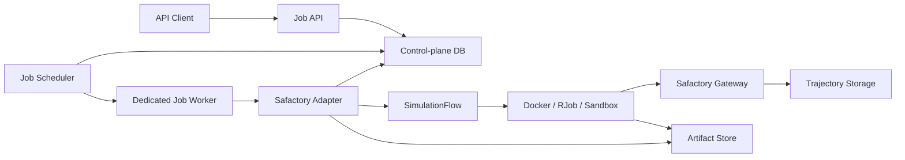
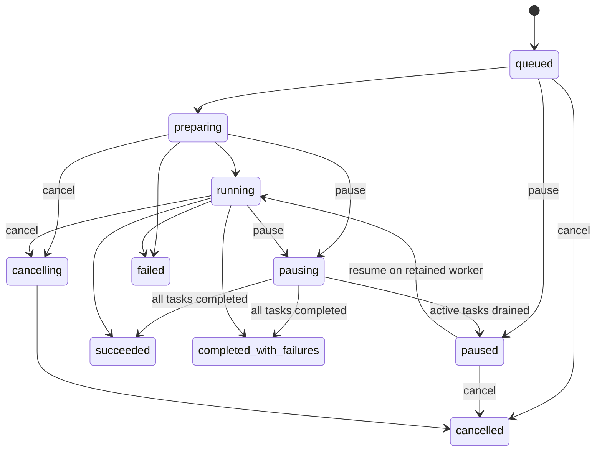

# Safactory Job Server 产品需求文档（PRD）

| 属性 | 内容 |
|---|---|
| 产品名称 | Safactory Job Server |
| 文档版本 | v1.0 |
| 文档状态 | Draft for Review |
| 更新日期 | 2026-08-12 |
| 目标版本 | MVP / v1 |

## 1. 文档目的

本文定义 Safactory Job Server 的产品目标、核心概念、功能范围、运行状态、非功能需求和验收标准。配套接口契约见 [API_DESIGN.md](./API_DESIGN.md)。

本产品采用以下总体方案：

> 将一次 Safactory 运行封装成独立 Job，作为调度、故障隔离和资源管理单元；Job 内部复用 Safactory 的 `SimulationFlow`，通过状态观察器、运行控制器和结果持久化接口向 Server 回传状态与数据。

## 2. 背景与问题

Safactory 已经具备以下执行能力：

- 从 Agent config 和 dataset 展开环境任务；
- 调度 Docker、RJob 和 Sandbox runtime；
- 创建独立 session，通过 Gateway 路由模型调用并记录轨迹；
- 执行 runner，产生 `SimulationStartResult`；
- 可选运行 evaluator 并写入 reward；
- 回收 runtime 并生成 Job 汇总。

当前能力主要通过 CLI 和进程内对象使用，缺少稳定的服务化控制面：

- 客户端无法通过统一 API 创建异步 Job；
- Job 中间状态和 Task 进度没有独立、持久化的查询模型；
- runner 结果、trajectory、evaluation 和文件产物没有统一返回入口；
- 缺少暂停、恢复、取消和删除等生命周期操作；
- API 进程与长时执行流程之间缺少故障隔离；
- 服务重启、重复请求和资源清理缺少明确语义。

## 3. 产品目标

### 3.1 MVP 目标

1. 提供稳定的 REST API 创建独立 Safactory Job。
2. 异步执行 Job，API 请求不等待 Job 完成。
3. 持久化 Job 和 Task 的运行状态、阶段、时间及错误。
4. 支持查询 Job 状态和 Task 进度。
5. 支持分页返回 Job 已产生的结果、轨迹引用和产物引用。
6. 支持协作式暂停、恢复和优雅取消。
7. 支持 Job 软删除和后台数据清理。
8. 保持 Safactory 现有 Docker、RJob、Sandbox、Gateway 和 evaluator 语义。
9. 通过幂等键避免网络重试产生重复 Job。

### 3.2 非目标

以下内容不属于 MVP：

- 逐步暂停并恢复一个正在执行的 Task；
- 对运行中的容器或远端作业使用 `SIGSTOP` 等强制冻结；
- Task 级手动重试、迁移或抢占；
- 跨 Job 共享 warm runtime pool；
- 任意用户上传并执行 Docker 命令、启动配置或宿主机挂载；
- 在线编辑 Safactory profile；
- 完整的多租户计费系统；
- WebSocket 实时日志终端；
- 对已经返回的结果提供永久归档保证。

## 4. 用户与使用场景

### 4.1 用户角色

| 角色 | 主要诉求 |
|---|---|
| 评测平台调用方 | 提交一批 benchmark task，轮询进度并获取分数和产物。 |
| Agent 平台 | 创建单任务或小批量运行，获取最终输出和轨迹。 |
| 运维人员 | 查看失败阶段、取消异常 Job、确认 runtime 是否回收。 |
| 管理员 | 管理可用 profile、并发限额、保留策略和访问权限。 |

### 4.2 典型流程

1. 调用方选择一个服务端已注册的 Environment Profile。
2. 调用创建接口，提交 runtime、模型 route、任务选择器和执行参数。
3. Server 返回 `202 Accepted` 和 `job_id`。
4. 调用方轮询 Job 状态或 Task 列表。
5. Job 完成后，调用方获取结果摘要、每个 Task 的输出、evaluation 和 artifact。
6. 调用方在不再需要 Job 时执行删除；Server 先软删除，再后台清理数据。

## 5. 核心领域模型

### 5.1 Environment Profile

由服务端维护的受信任执行模板，至少包含：

- `profile_id` 和版本；
- Safactory `agent_config`；
- Safactory `agent_start_config`；
- 允许使用的 runtime；
- 默认模型 route 和参数边界；
- task 输入 schema；
- 结果和 artifact 采集规则；
- evaluator 设置；
- 资源、超时和并发上限。

外部请求只能引用 profile，不得直接提交本地路径、runner command、Docker mount 或敏感凭据。

### 5.2 Job

一次外部创建的异步运行，也是本系统的基本调度和故障隔离单元。一个 Job：

- 对应一个公开 `job_id`；
- 对应一次 Safactory run；
- 使用同一个 profile、runtime、模型 route 和配置快照；
- 可以包含一个或多个同构 Task；
- 拥有独立日志目录、结果命名空间和状态生命周期。

### 5.3 Task

Job 中的一条实际任务，通常对应 Safactory dataset 中的一行：

- 对应一个 `task_id`；
- 对应 Safactory 的 `env_id/session_id`；
- 拥有独立 rollout、trajectory、evaluation 和 artifact；
- Task 的失败不必然导致整个 Job 失败。

### 5.4 Attempt

一次实际执行尝试。MVP 中每个 Task 默认只有一个 Attempt，但数据模型必须预留 `attempt_no` 和 `attempt_id`，避免将来增加重试时覆盖旧轨迹或结果。

### 5.5 Artifact

Job 或 Task 产生的文件型结果，包括但不限于：

- `safactory_result.json`；
- benchmark 输出；
- 日志文件；
- 补丁、报告、截图或数据库文件；
- 导出的 trajectory 文件。

API 只返回 artifact 元数据和受控下载地址，不返回容器内或宿主机绝对路径。

## 6. 总体架构

架构约束：

- API 进程不得直接在请求协程中运行 `SimulationFlow`；
- Job 由独立 worker 进程执行；
- 一个 worker 进程在同一时刻只运行一个 Safactory Job；
- Job 内部并发由 `pool_size` 和 `max_workers` 控制；
- API、worker 和 Gateway 可以独立扩缩容；
- Control-plane DB 是 Job 状态真相源；Safactory trajectory storage 是模型轨迹真相源；
- 两类存储通过 `job_id` 和 `session_id` 关联，不互相替代。

## 7. 功能需求

### FR-01 创建 Job

调用方可以提交：

- 名称及自定义标签；
- profile 及可选版本；
- runtime；
- 模型 route 和受限采样参数；
- profile dataset 选择器或符合 profile schema 的 inline tasks；
- 最大步数、Job 超时、Task 超时、并发数；
- 是否启用 evaluation。

系统必须：

1. 同步完成鉴权、请求 schema、profile 存在性和基础配额校验；
2. 持久化原始请求、规范化配置及 profile 版本快照；
3. 返回 `202 Accepted`；
4. 使用 `Idempotency-Key` 保证创建幂等；
5. 不在创建请求内等待 Gateway 或 runtime 就绪。

### FR-02 调度和执行 Job

Scheduler 必须：

- 按创建时间和优先级领取 `queued` Job；
- 使用数据库 lease 防止多个 worker 重复领取；
- 记录 worker ID、lease 到期时间和 heartbeat；
- 启动独立 Job 执行进程；
- 将规范化请求转换为 `SimulationRunConfig`；
- 调用 Safactory `SimulationFlow`；
- 在 `finally` 中执行 shutdown 和资源回收；
- 将 Job 退出原因转换成稳定的业务错误码。

### FR-03 查询 Job 状态

调用方可以查询：

- Job 当前状态和执行阶段；
- profile、runtime、模型和只读配置摘要；
- Task 总数及各状态计数；
- 创建、开始、更新时间和完成时间；
- 暂停、取消和删除请求状态；
- Job 级错误码、可读错误和失败阶段；
- 结果、Task 和 artifact 子资源链接。

查询必须只依赖持久化状态，不能要求原 worker 进程仍然在线。

### FR-04 查询 Task

调用方可以分页查询 Job 下的 Task，并按 Task 状态过滤。Task 信息至少包括：

- 公开 `task_id`；
- 外部业务 ID；
- `session_id`；
- 当前状态和阶段；
- step count、reward、truncated；
- 开始/完成时间；
- 稳定错误码和错误摘要；
- result、trajectory、artifact 链接。

### FR-05 返回 Job 运行数据

系统必须聚合并持久化：

- `SimulationStartResult`；
- evaluator 结果和最终 reward；
- trajectory 摘要及读取地址；
- final response；
- runtime 产生的 artifact；
- Job 级成功、失败、平均 reward 等汇总。

结果接口必须支持：

- Job 运行中返回已经完成的部分结果，并标记 `partial=true`；
- Job 终态后返回最终结果；
- Task 结果分页；
- 大文件通过 artifact 下载接口返回；
- 对敏感字段执行脱敏。

### FR-06 暂停 Job

MVP 的暂停为协作式 drain pause：

1. `queued` Job 暂停后立即进入 `paused`；
2. `running` Job 收到暂停请求后进入 `pausing`；
3. 调度器不再向该 Job 分配新的 Task；
4. 已经处于 provisioning、rollout 或 evaluating 的 Task 继续执行到终态；
5. 活跃 Task 清零且仍有 pending Task 时，Job 进入 `paused`；
6. 如果暂停收尾期间所有 Task 已经完成，Job直接进入相应完成态；
7. 暂停不冻结容器、线程或远端 Job；
8. 暂停期间保留原 Job worker、执行上下文和已预热 runtime，并持续 heartbeat；达到最大暂停时长后由策略自动取消 Job。

MVP 不承诺暂停请求立即生效。客户端应根据 `pausing → paused` 判断暂停完成。

### FR-07 恢复 Job

- 只有 `paused` Job 可以恢复；
- 恢复后由原 Job worker 从 `paused` 进入 `running`，继续调度剩余 Task；
- 已完成 Task 不得重复运行；
- 未完成 Task 使用原配置快照继续；
- 恢复操作必须幂等；
- `pausing` 状态下的恢复请求返回状态冲突，调用方应等待进入 `paused`。

MVP 暂停期间不释放 worker lease，也不跨 worker 恢复。这样可以保留 Safactory 的内存调度游标和 runtime lease，确保已完成 Task 不会被重新读取和执行。暂停中的 worker 仍计入项目并发配额。worker 在暂停期间失联时，Job 进入 `failed` 并记录 `WORKER_LOST`；跨 worker 恢复属于后续版本能力。

### FR-08 取消 Job

- `queued` 或 `paused` Job 可以直接取消；
- `running` Job 进入 `cancelling`；
- 停止领取新 Task；
- 请求活跃 Task 优雅终止；
- 达到 cancel grace period 后强制终止 Job worker；
- 最终执行 runtime orphan cleanup；
- 已完成 Task 结果仍可查询；
- 取消后的 Job 进入 `cancelled`，不能恢复。

### FR-09 删除 Job

删除采用两阶段语义：

1. 逻辑删除：Job 对普通查询立即不可见；
2. 物理清理：后台按保留策略删除 control records、trajectory、日志和 artifact。

规则：

- 终态 Job 可以直接软删除；
- 活跃 Job 默认禁止删除并返回冲突；
- 显式 `force=true` 时，系统先取消 Job，完成清理后再软删除；
- 删除接口必须幂等；
- MVP 不提供普通用户直接物理 purge 的能力；
- 审计记录不得随普通删除一起移除。

### FR-10 幂等性

- 创建 Job 必须支持 `Idempotency-Key`；
- 同一调用方、同一 key、相同请求返回原 Job；
- 同一 key、不同请求返回冲突；
- pause、resume、cancel 和 delete 必须具备重复调用的稳定行为；
- worker 领取和终态写入必须使用事务或乐观锁。

### FR-11 运行事件与可观测性

Safactory Adapter 必须提供事件接口，至少覆盖：

- Job phase changed；
- Task discovered；
- runtime allocated；
- Task started；
- rollout completed；
- evaluation completed；
- Task completed；
- Job completed。

事件用于更新控制面状态，不要求向最终用户暴露内部类名。

### FR-12 权限与安全

- 所有 Job 资源必须绑定 owner/project；
- 查询和操作必须校验资源归属；
- 外部输入不得成为本地文件路径、shell command 或 Docker mount；
- profile 参数必须通过 JSON Schema 或 Pydantic 模型验证；
- artifact 下载必须校验权限并防止路径穿越；
- 日志、结果和请求中的密钥、Authorization、Cookie 等字段必须脱敏；
- 删除、取消和管理员操作必须写入审计日志。

## 8. 状态模型

### 8.1 Job 状态

| 状态 | 是否终态 | 说明 |
|---|---:|---|
| `queued` | 否 | 已创建，等待 worker。 |
| `preparing` | 否 | 加载配置、展开 Task、检查 Gateway、准备存储。 |
| `running` | 否 | 至少有 Task 正在执行，或 Job 正在持续调度。 |
| `pausing` | 否 | 已停止领取新 Task，等待活跃 Task 收尾。 |
| `paused` | 否 | 无活跃 Task，等待恢复或取消。 |
| `cancelling` | 否 | 正在终止执行并回收资源。 |
| `succeeded` | 是 | 所有 Task 成功。 |
| `completed_with_failures` | 是 | Job 完成，但至少一个 Task 失败、超时或被取消。 |
| `failed` | 是 | Job 在无法形成有效 Task 结果的情况下失败，或发生 Job 级基础设施故障。 |
| `cancelled` | 是 | 用户或系统取消。 |

### 8.2 Task 状态

| 状态 | 是否终态 | 说明 |
|---|---:|---|
| `pending` | 否 | 已展开但未领取。 |
| `provisioning` | 否 | 正在分配 runtime。 |
| `running` | 否 | runner/agent rollout 正在执行。 |
| `evaluating` | 否 | rollout 已结束，正在评测。 |
| `succeeded` | 是 | Task 和必要 evaluation 成功。 |
| `failed` | 是 | Task 或 evaluation 失败。 |
| `timed_out` | 是 | 达到 runtime、Task 或 Job 超时。 |
| `cancelled` | 是 | 因 Job 取消而停止或未开始。 |

### 8.3 阶段字段

`phase` 用于补充状态，但不作为状态机控制条件。建议值：

- `validating_request`
- `expanding_tasks`
- `gateway_preflight`
- `provisioning_runtime`
- `episode_execution`
- `gateway_finalization`
- `evaluation`
- `artifact_collection`
- `cleanup`
- `finalizing`
- `completed`

## 9. 数据模型要求

### 9.1 `jobs`

至少保存：

- `job_id`、owner/project；
- name、profile ID/version；
- runtime、model；
- request JSON、normalized config JSON、配置摘要 hash；
- status、phase、status reason；
- Task 计数；
- pause/cancel/delete 请求标志；
- worker lease、heartbeat 和 fencing token；
- Safactory version/image digest；
- 错误码、错误信息和错误详情；
- created/started/updated/finished/deleted 时间；
- version 字段。

### 9.2 `job_tasks`

至少保存：

- `task_id`、`job_id`、external task ID；
- `session_id/env_id`；
- `attempt_id`、`attempt_no`；
- status、phase；
- runtime resource 摘要；
- `SimulationStartResult`；
- evaluation 和 reward；
- final response 和 trajectory 摘要；
- error；
- 时间字段。

### 9.3 `artifacts`

至少保存：

- artifact ID、job ID、可选 task ID；
- 类型、文件名、MIME、大小、checksum；
- storage backend 和 storage key；
- created/expired/deleted 时间。

### 9.4 `idempotency_records`

至少保存：

- owner/project；
- idempotency key；
- request hash；
- job ID；
- response status；
- created/expired 时间。

### 9.5 `job_events` 与审计记录

保存 Job 状态变更、操作者、来源、前后状态和关联 request ID。事件表用于排障和审计，不作为 Job 当前状态的唯一来源。

## 10. 非功能需求

### 10.1 可用性与一致性

- API 实例重启不应丢失已接受的 Job；
- 状态写入必须先于成功响应；
- 同一个 Job 同一时刻只能被一个有效 fencing token 的 worker 修改；
- 终态不可逆；
- Job 状态和 Task 计数允许短暂最终一致，但不得回退到更早状态；
- worker 失联后 Job 必须在可配置时间内进入恢复或失败处理，而不能永久 `running`。
- 暂停中的 worker 必须持续 heartbeat，并计入 worker 和项目并发占用。

### 10.2 性能目标

MVP 建议目标：

| 指标 | 目标 |
|---|---|
| 创建 Job API P95 | 小于 300 ms，不含外部鉴权服务延迟 |
| 查询 Job API P95 | 小于 200 ms |
| 结果分页 API P95 | 小于 500 ms，不含 artifact 文件下载 |
| 接受 Job 后可见性 | 小于 1 秒 |
| 运行状态更新延迟 | 正常情况下小于 5 秒 |
| 取消请求进入 `cancelling` | 小于 2 秒 |

这些目标不包含 Safactory runtime 创建和模型推理耗时。

### 10.3 容量和限制

默认限制应可配置：

- 每个 Job 最大 Task 数；
- 每个项目的 queued/running Job 数；
- Job 最大运行时长；
- 最大暂停时长；
- 单 artifact 及 Job artifact 总大小；
- 请求体大小；
- `pool_size` 和 `max_workers` 上限；
- 结果分页 `limit` 上限。

### 10.4 可观测性

必须记录：

- request ID、job ID、task ID、session ID；
- API 延迟和错误率；
- Job 排队时长、运行时长和各阶段时长；
- running/queued/paused Job 数；
- Task 成功、失败、超时数；
- worker heartbeat、orphan runtime 清理结果；
- artifact 数量和大小；
- Gateway preflight 和 evaluation 失败。

## 11. 错误分类

错误应至少分为：

| 类别 | 示例 |
|---|---|
| 请求错误 | profile 不存在、参数超限、任务输入不符合 schema。 |
| 调度错误 | 无可用 worker、配额不足、worker lease 丢失。 |
| 前置检查错误 | Gateway 不可用、模型 route 不存在、存储配置不一致。 |
| runtime 错误 | 镜像不存在、容器启动失败、RJob/Sandbox 创建失败。 |
| rollout 错误 | runner 非零退出、结果 JSON 非法、超时。 |
| evaluation 错误 | evaluator 不存在、执行失败、reward 写入失败。 |
| artifact 错误 | 文件不存在、超过大小限制、上传失败。 |
| 控制冲突 | 对终态 Job 暂停、对运行 Job直接删除。 |

外部错误必须使用稳定 `error.code`；堆栈、内部路径和密钥不得直接返回。

## 12. MVP 验收标准

### 12.1 创建与幂等

- 使用有效 profile 创建 Job，接口返回 202 和唯一 `job_id`；
- 使用相同幂等键和相同请求重复调用，返回同一个 Job；
- 相同幂等键配合不同请求返回 409；
- 无效 profile 或越权请求不创建 Job。

### 12.2 状态与执行

- 单 Task Docker Job 可以完成完整状态流转；
- 多 Task Job 能正确统计 pending/running/succeeded/failed；
- Gateway 不可用时 Job 进入 `failed`，错误阶段为 `gateway_preflight`；
- Task runner 超时时 Task 进入 `timed_out`，Job 汇总正确；
- worker 异常退出后 Job 不会永久保持 `running`。

### 12.3 结果

- 可以读取 `SimulationStartResult`、reward 和 final response；
- Job 运行时能读取已经完成的部分结果；
- trajectory 和 artifact 通过受控子资源访问；
- 大结果不会被强制内联到 Job 状态接口；
- 返回数据不包含宿主机绝对路径和敏感凭据。

### 12.4 暂停、恢复与取消

- queued Job 可以立即暂停并恢复；
- running 多 Task Job 暂停后不再启动新 Task；
- 活跃 Task 收尾后 Job 进入 `paused`；
- 恢复后只执行剩余 Task；
- 取消后 active runtime 在 grace period 后被清理；
- 对终态 Job 的 pause/resume 返回明确冲突。

### 12.5 删除

- 终态 Job 删除后普通查询返回 404；
- 活跃 Job 默认删除返回 409；
- `force=true` 会先取消再删除；
- 重复删除不会创建错误资源或重复执行危险清理；
- 后台清理失败可以重试且有监控告警。

## 13. 分阶段交付

### Phase 1：最小闭环

- Profile catalog；
- Job/Task 控制面表；
- 创建、查询、列表；
- 独立 worker 运行 `SimulationFlow`；
- Observer 和 ResultSink；
- Docker 单 Task和多 Task；
- 结果和 artifact 查询；
- drain pause/resume；
- cancel 和软删除；
- heartbeat、fencing、基础 orphan cleanup。

### Phase 2：运行时扩展和生产强化

- RJob/Sandbox；
- 完整配额和审计；
- 云端 artifact store；
- 故障注入和更完整的 orphan cleanup。

### Phase 3：规模化

- 多 worker 调度；
- 云端 control DB 和对象存储；
- webhook；
- Task retry/attempt API；
- 更细粒度优先级和租户资源治理；
- 评估抽取 Safactory SDK 和跨 Job warm pool。

## 14. 风险与决策

| 风险 | 影响 | 应对 |
|---|---|---|
| Safactory 最终结果主要保存在进程内 | Server 可能拿不到完整结果 | 增加默认 no-op 的 Observer 和 ResultSink。 |
| Safactory 当前不是稳定 SDK | 直接拆内部组件容易产生第二套流程 | 第一阶段整体调用 `SimulationFlow`。 |
| 暂停无法安全冻结当前 Task | 暂停延迟可能较长 | 明确定义 drain pause，只停止新 Task。 |
| 暂停时 worker 和 warm runtime 持续占资源 | 成本增加 | 暂停仍计入配额，并设置最大暂停时长后自动取消。 |
| worker 进程意外退出 | active Job 状态和 runtime 可能遗留 | heartbeat、fencing token、orphan cleanup。 |
| SQLite 多 worker 写冲突 | 无法可靠横向扩展 | SQLite 仅用于本地；生产使用 PostgreSQL/control DB 和共享 trajectory storage。 |
| profile 可执行内容具有高权限 | 供应链和宿主机风险 | profile 管理员审核、镜像 digest、禁止外部命令和 mount。 |

## 15. 待确认项

1. MVP 是否只支持 Docker，还是同时要求 RJob/Sandbox？
2. 首批需要注册哪些 Environment Profile？
3. inline task 是否为 MVP 必需，还是只允许从 profile dataset 选择？
4. 最大 Task 数、默认并发和最大暂停时长是多少？
5. Control-plane 生产数据库是否确定为 PostgreSQL？
6. artifact 存储使用本地卷、S3 还是现有对象存储？
7. 是否需要 v1 即支持完成 webhook？
8. Job 数据和 artifact 的默认保留周期是多少？
