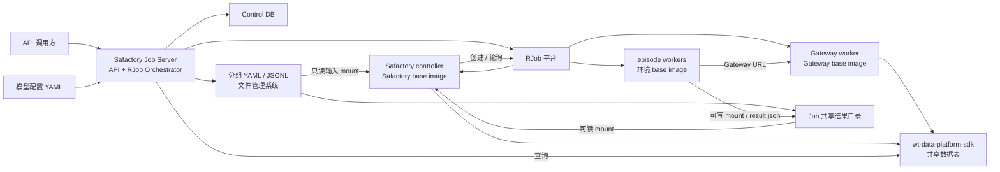
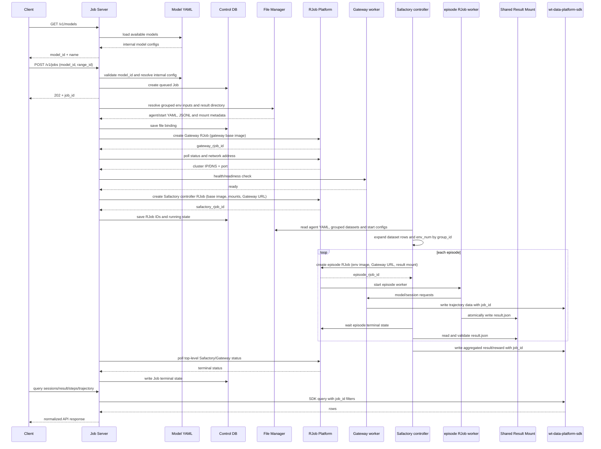

# Safactory Job Server 产品需求文档（PRD）

| 属性 | 内容 |
|---|---|
| 产品名称 | Safactory Job Server |
| 文档版本 | v2.3 |
| 文档状态 | Draft for Review |
| 更新日期 | 2026-08-20 |
| 目标版本 | MVP / v1 |

## 1. 文档目的

本文定义 Safactory Job Server 的产品边界、两级 RJob 调度方式、Gateway 与 Safactory 工作负载的启动顺序、按环境分组的 YAML/`dataset.jsonl` 管理、共享结果 mount、运行状态和查询数据链路。

对外接口字段、路径、状态和错误响应以 [API_DESIGN.md](./API_DESIGN.md) 为准。

核心方案：

> 系统提供一个统一的 Job Server，对外实现 API 文档中的全部接口。创建 Job 后，Server 通过 RJob 平台依次创建两个顶层工作负载：必须先从 Gateway base image 启动 Gateway 并取得集群内可访问地址，再从 Safactory base image 启动 Safactory controller。Safactory controller 读取按 `environments` 分组的 YAML 和对应 `dataset.jsonl`，进一步为各任务/episode 创建下游 RJob worker。下游 worker 将结果写入 YAML 指定的共享结果 mount，Safactory controller 从同一存储读取、汇总并通过数据写入链路持久化；公开查询仍统一通过 `wt-data-platform-sdk` 完成。

除特别说明外，本文中的 Job 指 `POST /v1/jobs` 创建的一次靶场任务；“Gateway worker”指 Job Server 创建的 Gateway RJob；“Safactory controller”指 Job Server 创建的顶层 Safactory RJob；“episode worker”指 Safactory controller 进一步创建的下游 RJob。本文所称“两个顶层 RJob”不包含数量随环境分组和运行次数变化的 episode worker。

## 2. 背景与问题

Safactory 基于 YAML 的 `environments` 配置和 dataset 文件展开任务分组，通过下游 RJob worker 经 Gateway 发起模型请求，生成 Session/trajectory 并把数据写入数据平台。Job Server 与顶层 Safactory controller 分别承担一级、二级调度职责：

- 用一个长期运行的 Server 承载 API 文档中的六个接口；
- 将 HTTP 请求与异步 RJob 执行解耦；
- 为每个 Job 创建独立的 Gateway worker 和 Safactory controller；
- 保证 Gateway 先就绪，并将其集群内可访问地址传给 Safactory controller 及其下游 worker；
- 统一管理 Safactory 所需的分组 YAML、各组 `dataset.jsonl` 和结果 mount，建立稳定的 `job_id` 文件映射；
- 由 Safactory controller 按环境分组和运行次数创建、监控并回收下游 episode RJob；
- 由下游 worker 写共享结果文件，并由 Safactory controller 从 mount 读取后汇总；
- 在 Server 重启后根据持久化的顶层 RJob ID 恢复 Job 状态；
- 通过 `wt-data-platform-sdk` 查询 Session、得分和轨迹。

## 3. 产品目标与范围

### 3.1 MVP 目标

以下为完整 MVP 的最终目标，并在 Roadmap Phase 2 完成。Phase 1 只实现同一套公开 API 的 Mock Server，用于接口联调，不创建 RJob，也不访问真实数据平台。

1. 部署一个 Safactory Job Server，实现 [API_DESIGN.md](./API_DESIGN.md) 定义的所有接口。
2. 使用一个服务端 YAML 文件统一管理模型信息；`GET /v1/models` 只返回 `model_id` 和 `name`。
3. 使用 `model_id + range_id` 创建异步 Job，并立即返回 `202 Accepted` 和 `job_id`。
4. Job 调度统一通过 RJob 平台完成：Server 负责两个顶层 RJob，Safactory controller 负责下游 episode RJob。
5. 提供可被 RJob 拉取的 Gateway base image 和 Safactory base image，并记录实际使用的不可变版本或 digest。
6. 每个 Job 先创建一个 Gateway RJob；仅当 Gateway 地址已取得且健康检查通过后，才创建顶层 Safactory controller RJob。
7. 创建 Safactory controller 时，把 `job_id`、模型信息、Gateway URL、分组 YAML/JSONL 输入 mount、共享结果 mount 和下游 RJob 提交配置传入工作负载。
8. 统一文件管理系统维护 `range_id → 环境分组模板`、`job_id → 已解析输入版本` 和 `job_id → 结果目录` 的映射。
9. Safactory controller 读取 YAML 根节点 `environments`：每条 dataset 记录形成一个任务分组，`env_num` 个副本共享同一 `group_id`，每次 episode 运行创建一个下游 RJob worker。
10. YAML/受信任启动配置必须指定下游 RJob 的结果 mount；下游 worker 将结果写入按 `job_id/session_id` 隔离的文件，Safactory controller 从同一共享存储读取并汇总。
11. Server 持久化 Job 状态、两个顶层 RJob ID、Gateway 地址、文件绑定、结果 mount 引用和下游运行摘要，重启后可继续轮询和清理。
12. Session、结果和轨迹查询全部通过 `wt-data-platform-sdk` 访问共享数据表，并始终包含 `job_id` 过滤条件。

### 3.2 MVP 范围边界

- 公开 API 范围为 [API_DESIGN.md](./API_DESIGN.md) 定义的六个接口；
- Job 停止仅供超时策略和运维内部使用；
- 模型 YAML、Safactory YAML/JSONL、image、运行命令、输入/结果 mount 和凭据由服务端受信任配置提供；
- 暂停恢复、Session/step 级重试和手动停止不在 MVP 范围内。

### 3.3 分阶段交付原则

- Phase 1 和 Phase 2 必须使用同一份 [API_DESIGN.md](./API_DESIGN.md) 契约；路径、请求字段、响应字段、HTTP 状态码和稳定错误码不得因数据来源不同而变化；
- Phase 1 使用本地 Mock 实现，仅用于接口调用、前后端联调和契约测试，不表示真实 Job 已被调度；
- Phase 2 保留 Phase 1 的 API 层，替换 Job 调度和运行数据适配器，接入真实 RJob、image、mount 和 `wt-data-platform-sdk`；
- Mock 和真实实现必须通过明确的部署配置切换。真实模式依赖异常时不得静默回退 Mock 数据，以免把伪造结果当作真实结果；
- 每个阶段必须通过本阶段验收门槛后才能进入下一阶段。

## 4. 用户角色与核心场景

### 4.1 用户角色

| 角色 | 主要诉求 |
|---|---|
| API 调用方 | 查询模型、创建 Job、轮询 Session、查询得分与轨迹。 |
| Job Server | 校验请求、持久化 Job、编排两个顶层 RJob、提供查询接口。 |
| Safactory controller | 解析环境分组、创建 episode RJob、回收结果并汇总。 |
| 文件管理员 | 维护 `range_id` 对应的分组 YAML、`dataset.jsonl`、结果目录规则和版本。 |
| 运维人员 | 查看顶层/下游 RJob 状态、定位启动失败并清理异常工作负载。 |
| 数据平台 | 持久化并提供 Session、step、trajectory 和 reward 查询。 |

### 4.2 正常执行流程

1. Server 从统一模型 YAML 中读取可用模型；调用方通过 `GET /v1/models` 取得 `model_id` 和模型名称，并持有基座提供的 `range_id`。
2. 调用方通过 `POST /v1/jobs` 提交 `model_id + range_id`。
3. Server 校验模型、靶场和文件模板，生成唯一 `job_id`，持久化 `queued` Job 并返回 `202 Accepted`。
4. 后台编排器领取 Job，根据 `range_id` 解析按 `environments` 分组的 YAML 和各组 `dataset.jsonl`，为该 `job_id` 发布不可变输入绑定并分配共享结果目录。
5. Server 使用 Gateway base image 创建 Gateway RJob，并写入 `job_id`、模型路由和运行参数。
6. Server 轮询 Gateway RJob，等待其进入可运行状态，从 RJob 平台取得集群内 IP/DNS 和端口，再执行 Gateway 健康检查。
7. Gateway 就绪后，Server 组合出 Safactory 可访问的 Gateway URL。
8. Server 使用 Safactory base image 创建 Safactory controller RJob，传入 `job_id`、`model_id`、Gateway URL、YAML/JSONL 输入 mount、共享结果 mount、Safactory 启动参数和下游 RJob 提交配置。
9. Safactory controller 从 mount 读取 YAML 与 dataset，根据 `environments[]` 展开任务：每条 dataset 记录形成一个逻辑任务组，`env_num` 个运行副本共享同一 `group_id`。
10. Safactory controller 为每次 episode 创建一个下游 RJob worker，向其注入 `job_id`、`group_id`、`session_id`、Gateway URL、环境参数和结果路径；下游 worker 的模型请求发往该 Job 的 Gateway。
11. episode worker 将标准结果文件写入共享结果 mount。其进入终态后，Safactory controller 从同一 mount 读取并校验结果，再进行汇总/评估并通过数据写入链路持久化结果和 reward。
12. Gateway 和 Safactory controller 通过数据写入链路把 Session、step、trajectory 和结果写入 `wt-data-platform-sdk` 管理的共享数据表，记录中包含 `job_id`。
13. Server 持续轮询两个顶层 RJob 的状态；所有必须的下游 RJob 已结束、结果已被读取并持久化，且 Safactory controller 成功退出后，Job 才进入 `succeeded`。
14. 调用方通过 API 轮询 Session、得分和轨迹；Server 使用 SDK 按 `job_id` 及相关 Session/step 条件查询并归一化返回。

### 4.3 失败与清理流程

- 文件绑定创建失败时，不创建任何 RJob，Job 直接进入 `failed`。
- Gateway RJob 创建或启动失败时，不得创建 Safactory controller RJob；Job 进入 `failed` 并清理 Gateway RJob。
- Gateway 已启动但无法取得可路由地址或健康检查失败时，不得创建 Safactory controller RJob。
- Safactory controller RJob 创建失败时，Job 进入 `failed`，并清理已创建的 Gateway RJob。
- 环境分组展开、下游 RJob 提交、下游执行或结果文件校验失败时，Safactory controller 按配置执行有限重试；超过阈值后终止剩余下游 RJob 并以失败退出。
- 下游 RJob 已结束但共享结果文件不存在、不完整或无法读取时，不得把该运行判定为成功。
- Safactory 运行期间 Gateway 异常退出时，Safactory controller 先停止下游 RJob，再由 Server 停止 Safactory controller、清理 Gateway，Job 进入 `failed`。
- Safactory controller 异常退出时，Server 保留已成功写入数据平台的数据和已发布的结果文件，记录错误摘要，并进入嵌套清理流程。
- 清理顺序始终为下游 episode RJob、Safactory controller、Gateway，避免 Gateway 先退出导致仍在运行的 worker 请求失败，也避免结果文件尚未读取即删除下游现场。
- RJob 删除失败时进入后台清理队列，不得阻塞 API 查询已持久化的数据。

## 5. 核心领域模型

### 5.1 Job

Job 是外部创建和查询的最小任务单元：

- 由不透明的 `job_id` 唯一标识；
- 绑定一个 `model_id`、对应模型配置版本和一个 `range_id`；
- 绑定一个不可变的分组 YAML/`dataset.jsonl` 文件版本和一个隔离的结果目录；
- 最多拥有一个有效 Gateway RJob 和一个有效 Safactory controller RJob，并可由 controller 创建零到多个下游 episode RJob；
- 可以产生一个或多个 Session；
- `job_id` 同时写入 RJob label/env、日志和数据平台记录，用于跨组件关联和数据过滤；
- Job 访问控制由 Server 独立校验。

### 5.2 Gateway worker

Gateway worker 是从 Gateway base image 创建的一个 RJob：

- 必须先于 Safactory controller 创建；
- 接收 `job_id` 和由 `model_id` 解析出的可信模型路由配置；
- 对 Safactory controller 及其下游 episode worker 暴露集群内可访问的 IP/DNS 和端口；
- 必须提供可配置的 readiness/health 检查；
- 一个 Gateway worker 只服务一个 Job；
- 实际 RJob ID、image 版本、地址、端口和状态必须持久化；
- Safactory controller 及其所有下游 episode worker 退出后才能停止或删除 Gateway worker。

### 5.3 Safactory controller

Safactory controller 是 Job Server 从 Safactory base image 创建的顶层 RJob：

- 只能在对应 Gateway worker ready 后创建；
- 启动参数由 Server 生成，不接受调用方提供的任意命令；
- 接收 `job_id`、`model_id`、Gateway URL、cloud storage/SDK 配置和下游 RJob 提交配置；
- 以只读方式 mount 当前 Job 的分组 YAML 与各组 `dataset.jsonl`，并以可读方式 mount 共享结果目录；
- YAML 中的数据集路径必须指向容器内实际 mount 的 `dataset.jsonl`，下游结果 mount 和结果根目录必须可解析；
- 按 Safactory CLI/entrypoint 约定解析环境分组并创建下游 episode RJob，而不是在顶层 RJob 内直接完成所有 episode；
- 为下游 worker 传入该 Job 的 Gateway URL、分组标识和唯一结果路径；
- 等待下游 RJob 终态，从共享 mount 读取、校验和汇总结果；
- 退出码和 RJob 终态转换为稳定的内部 Job 状态和错误分类。

### 5.4 环境分组与 episode worker

- agent config YAML 根节点必须为 `environments`，其中每个条目定义一个环境组，至少包含 `env_name`、`env_image`、`env_num`、`dataset` 和 `env_params`，并按 `env_name` 关联一份 agent start config YAML；
- 每条 dataset 记录是一个逻辑任务，按 `env_name + task_idx` 生成稳定 `group_id`；同一任务的 `env_num` 个运行副本共享该 `group_id`，但使用不同 `env_id/session_id`；
- 每次 episode 运行对应一个下游 RJob worker，使用环境组声明的 image 和关联 agent start config 中受信任的下游 RJob 启动配置；
- episode worker 不直接由 Job Server 创建或管理；Safactory controller 负责提交、轮询、重试和停止；
- episode worker 必须把标准结果文件写入唯一的共享结果路径，Safactory controller 读取成功后才能完成该 episode 的结果回收。

### 5.5 Job 文件集

每个 Job 文件集至少包含：

- 一份 Safactory agent config YAML，其 `environments[]` 定义一个或多个环境组；
- 每个环境组按 `env_name` 关联一份 agent start config YAML，定义 runner 和下游 RJob 配置；
- 每个环境组绑定一份 `dataset.jsonl`；单组场景可只有一份；
- 文件版本、checksum、创建时间和来源 `range_id`；
- 输入文件的容器内 mount 目录与最终文件路径；
- 共享结果目录、controller 读取路径和 episode worker 写入路径；
- 可选的模板渲染参数，但不得包含明文密钥。

文件集发布后对该 Job 不可变。需要修改配置时必须创建新 Job 或新的文件版本，不得在运行中原地覆盖。

### 5.6 Session 与 Step

- Session 使用 `session_id`，并通过数据平台记录中的 `job_id` 归属于一个 Job；
- Step 在 Session 内有稳定的 `step_id` 和顺序；
- Server 通过 SDK 查询共享表并按 API 文档归一化返回。

## 6. 总体架构



架构约束：

- RJob 编排是 Job Server 的内部模块。
- Server 只提交、轮询和清理两个顶层 RJob，不承载 Safactory 或 Gateway 的业务进程，也不直接提交 episode worker。
- 一个 Job 固定创建两个顶层工作负载：一个 Gateway RJob、一个 Safactory controller RJob；下游 episode RJob 数量由环境分组、dataset 条数、`env_num` 和运行策略决定。
- Gateway 和 Safactory 顶层 RJob 引用预构建 base image，不在 Job 创建路径上构建 image；episode worker 使用环境组声明的受信任 image。
- Gateway ready 和地址发现是创建 Safactory controller RJob 的硬前置条件。
- YAML/JSONL 必须来自受控文件管理系统，并通过 RJob 可访问的共享存储只读 mount。
- episode worker 和 Safactory controller 必须 mount 同一结果存储：worker 可写，controller 可读；结果文件在 controller 成功读取和持久化前不得清理。
- Server 通过 `wt-data-platform-sdk` 公共接口查询运行数据。

## 7. 模型配置管理

### 7.1 模型 YAML

所有模型信息统一保存在一个服务端 YAML 文件中。该文件由运维配置管理，不通过公开 API 修改。

每个模型配置至少包含：

- 全局唯一且非空的 `model_id`；
- 非空的模型名称 `name`；
- 是否可用于创建新 Job 的状态；
- Gateway 启动所需的模型路由及内部配置。

模型路由、服务地址、鉴权引用及其他内部配置仅用于 Server 校验 Job 和生成 Gateway RJob 配置。

### 7.2 `GET /v1/models` 返回约束

- Server 从模型 YAML 读取当前可用于新 Job 的模型；
- 每个响应条目只能包含 `model_id` 和 `name`；
- 响应不得包含模型路由、服务地址、鉴权引用、可用性配置或其他 YAML 字段；
- YAML 文件不存在、不可读、格式错误、`model_id` 重复或必要字段缺失时，模型配置不可用；
- `POST /v1/jobs` 必须从同一模型 YAML 再次校验 `model_id`，并使用对应内部配置创建 Gateway RJob；
- Server 应记录已加载模型 YAML 的版本或 checksum，Job 记录保存创建时使用的配置版本。

## 8. Base image 与 RJob 规范

### 8.1 Base image 管理

系统配置中至少维护：

| 配置项 | 说明 |
|---|---|
| `gateway_base_image` | Gateway worker 使用的 registry image，生产环境应固定 digest |
| `safactory_base_image` | Safactory controller 使用的 registry image，生产环境应固定 digest |
| `image_pull_policy` | RJob 拉取策略 |
| `gateway_resources` | Gateway 的 CPU、内存及其他资源 |
| `safactory_resources` | Safactory controller 的 CPU、内存、GPU 及其他资源 |
| `episode_rjob_defaults` | 下游 episode RJob 的资源、超时、重试和保留策略 |
| `rjob_namespace` | 工作负载所在 namespace |
| `charged_group` | RJob 配额或计费组 |

Gateway 与 Safactory 的 image 必须集中写入同一份服务端初始化 YAML，不接受调用方字段或独立环境变量覆盖。真实 image 尚未提供时可在该 YAML 中使用明确标记的 Mock placeholder，但不得据此伪造 RJob 或 Job 成功。Image 和资源配置由服务端管理。Server 必须在 Job 记录中保存两个顶层工作负载实际使用的 image 引用；episode image 版本由 Safactory controller 的运行摘要关联记录。

### 8.2 Gateway RJob 提交

Gateway RJob 至少包含：

- 可幂等重建的 RJob 名称，建议由 `job_id` 派生；
- Gateway base image；
- `job_id` label/env；
- 由 `model_id` 解析的模型路由配置引用；
- listen port 和 health/readiness 配置；
- 资源、超时、日志和自动清理策略；
- 数据平台所需的部署级配置引用。

RJob 创建成功只表示工作负载已提交，不表示 Gateway 可用。Server 必须继续完成地址发现和健康检查。

### 8.3 Gateway 地址发现

Server 必须从 RJob 平台取得 Safactory 容器可访问的网络信息：

- 优先使用平台提供的集群内 DNS/Service 地址；
- 仅在平台明确保证 IP 生命周期和可路由性时使用 Pod/worker IP；
- 地址不得使用 `127.0.0.1` 或 `localhost`；
- Server 使用地址和配置端口组成 Gateway URL；
- Gateway URL 必须通过健康检查后才能传给 Safactory；
- 实际地址、端口、URL 和发现时间必须写入 Job 记录。

### 8.4 Safactory controller RJob 提交

Safactory controller RJob 至少包含：

- Safactory base image；
- `job_id`、`model_id` 和已验证的 Gateway URL；
- 分组 YAML/`dataset.jsonl` 的只读输入 mount 配置；
- Job 共享结果存储的 mount 配置、controller 读取根目录和下游 worker 写入根目录；
- Safactory entrypoint/CLI 参数；
- 下游 RJob 平台访问配置，以及受信任的资源、超时、重试、日志和保留策略；
- cloud storage 模式及 `wt-data-platform-sdk` 部署级配置；
- 资源、运行超时、日志和自动清理策略。

提交前必须再次确认 Gateway 仍处于 ready 状态。Safactory controller RJob 创建后，Server 保存顶层 RJob ID 并进入运行状态轮询。controller 获得的 RJob 权限只能用于当前 Job 对应的下游工作负载，并应通过 namespace、label 和资源策略限制作用域。

### 8.5 episode RJob 提交

Safactory controller 为每次 episode 创建一个下游 RJob，至少包含：

- 从当前环境组解析的受信任 `env_image`；
- `job_id`、`group_id`、`env_id`、`session_id` 和父级 Safactory RJob ID；
- 已验证的 Gateway URL 和当前任务的环境参数；
- 共享结果存储的可写 `mount_config`；
- 唯一结果文件路径，推荐通过 `SAFACTORY_RESULT_PATH` 注入；
- 资源、超时、日志、重试和回收配置。

同一 episode 的幂等提交键必须稳定。controller 必须先确认下游 RJob 终态，再从结果 mount 读取文件；RJob 成功但结果文件缺失或校验失败仍视为 episode 失败。

## 9. YAML 与 dataset.jsonl 文件管理

### 9.1 管理目标

传给 Safactory controller 的 YAML 和 `dataset.jsonl` 对应现阶段 Safactory 的 `env` 输入。后端必须提供统一文件管理能力，对这些输入按环境组组织，并为下游 episode 提供可回收结果的共享 mount。该能力可以是 Server 内部模块，也可以是独立文件服务，但对 Job Server 必须提供稳定的元数据接口。

文件管理系统负责：

1. 维护 `range_id` 对应的 agent config YAML、各环境组 `dataset.jsonl` 和 agent start config YAML；
2. 创建 Job 时校验 agent config YAML 根节点 `environments`、每个环境组、dataset 文件、对应 start config 和结果 mount 配置有效且版本兼容；
3. 为 `job_id` 建立不可变文件绑定；
4. 必要时渲染 Job 专属 agent/start config YAML，使各组 dataset 路径、结果根目录和下游 `rjob.mount_config` 指向容器内实际 mount；
5. 将输入文件和结果目录发布到 RJob 集群可访问的共享存储；
6. 返回输入/结果 mount source、不同容器内的 target、文件版本和 checksum；
7. 提供按 `job_id` 查询输入绑定、环境组和结果目录的内部能力，供重启恢复和审计使用。

### 9.2 `environments` 分组与 start config 配对

agent config YAML 使用 Safactory 当前 `environments` 结构，只负责定义任务分组、dataset 和环境参数：

```yaml
environments:
  - env_name: <environment-name>
    env_image: <trusted-environment-image>
    env_num: <replica-count>
    dataset: /mnt/safactory-job/groups/<env-name>/dataset.jsonl
    env_params:
      safactory_results_root: /app/results
```

每个 `env_name` 必须关联一份 agent start config YAML。该文件定义 runner 和下游 RJob，其中 `rjob.mount_config` 指定结果 mount：

```yaml
agent_name: <environment-name>
container:
  runner_entrypoint:
    source: <trusted-runner-source>
    target: <runner-target>
    command: <trusted-command>
rjob:
  mount_config:
    - <result-storage-source>:/app/results
```

约束如下：

- `environments[]` 的一个条目定义一个环境组，而不是一个最终 worker；
- `env_name` 必须与对应 start config 的 `agent_name` 一致；找不到、重复或不匹配时配置无效；
- 每条 dataset 记录按其稳定 `task_idx` 形成一个逻辑任务组；`group_id` 由 `env_name + task_idx` 稳定派生；
- `env_num` 表示该任务组的并行副本数；副本共享 `group_id`，但 `env_id`、`session_id` 和结果文件路径必须唯一；
- 每个实际 episode 由 Safactory controller 创建为一个下游 RJob worker；
- 调用方不能直接提交或覆盖 `env_image`、start config、`rjob.mount_config`、结果根目录或任意命令；这些字段必须由受信任模板生成或校验。

### 9.3 文件映射

逻辑映射如下：

```text
range_id
  -> agent_config_yaml_version
  -> environment groups
       -> dataset_version
       -> agent_start_config_yaml_version
       -> trusted env image / episode RJob config / result mount
  -> create job_id binding
       -> rendered config.yaml
       -> groups/<env-group>/dataset.jsonl
       -> groups/<env-group>/start.rjob.yaml
       -> read-only input mount source / target
       -> isolated result directory
       -> controller read target / episode write target
       -> checksums
```

推荐将输入和结果分开管理：输入目录对 Safactory controller 只读，结果目录由 episode worker 写入并由 controller 读取。

```text
<shared-storage>/safactory/
├── jobs/<job_id>/input/
│   ├── config.yaml
│   └── groups/
│       └── <env-group>/
│           ├── dataset.jsonl
│           └── start.rjob.yaml
└── results/<job_id>/
    └── <session_id>/result.json

Safactory controller 容器内：
/mnt/safactory-job/config.yaml
/mnt/safactory-job/groups/<env-group>/dataset.jsonl
/mnt/safactory-job/groups/<env-group>/start.rjob.yaml
/app/results/<job_id>/<session_id>/result.json

episode worker 容器内：
/app/results/<job_id>/<session_id>/result.json
```

controller 与 episode worker 推荐把同一结果存储 source 都 mount 到 `/app/results`，以便直接使用当前兼容路径 `/app/results/<job_id>/<session_id>/result.json`。如使用不同 target，controller 必须有确定的路径映射；也可通过 `SAFACTORY_RESULT_PATH` 指定等价的唯一文件路径。实际约定必须在模板中固定。

### 9.4 输入发布与 mount 规则

- mount source 必须位于 RJob 集群可访问的共享存储，不能是 Server 的本地临时路径；
- agent config YAML、各组 start config YAML 和 JSONL 在提交 Safactory controller RJob 前必须完成 schema/语法校验；
- agent config YAML 中每个环境组引用的 dataset 路径必须能在 controller 容器内解析到已 mount 文件；文件绑定中与 `env_name` 配对的 start config 也必须可读；
- 输入 mount 对 Safactory controller 只读；
- Job 运行期间文件不得原地修改或删除；
- 文件发布必须原子化，禁止 controller 读取到只写入一半的文件；
- 文件版本和 checksum 必须写入 Job 记录；
- 文件中不得写入 RJob AK/SK、模型密钥或数据平台明文凭据；
- 文件保留与清理由统一策略管理，不与 RJob 删除操作绑定。

### 9.5 结果 mount 与回收规则

- 每个环境组对应的 agent start config YAML 必须指定 `rjob.mount_config` 和结果根目录；缺少结果 mount 的配置不得进入调度；
- 结果 mount 必须使用同一个 Job 隔离的共享存储 source：episode worker 以可写方式挂载，Safactory controller 至少以可读方式挂载；controller 如承担清理职责可获得受限写权限；
- 每个 episode 必须使用包含 `job_id` 和 `session_id`（或等价唯一 ID）的独立路径，禁止不同副本覆盖同一文件；
- episode worker 必须先将结果写入临时文件，再以原子 rename/commit 发布最终 `result.json`，避免 controller 读取半成品；
- controller 只有在下游 RJob 进入终态且最终文件存在、格式有效、标识匹配后，才能认定结果回收成功；
- controller 读取后负责将结果与 `job_id/group_id/session_id` 关联并完成汇总/评估；对外结果仍须写入数据平台并通过 SDK 查询；
- 下游 RJob 和结果文件在 controller 完成读取、校验和数据持久化前不得删除；失败现场按保留策略处理；
- 结果目录是 episode worker 到 Safactory controller 的内部交接介质，不是公开查询 API 的数据源。

## 10. 运行数据与 API 查询

### 10.1 数据边界

- 运行数据由 Safactory/Gateway 写入 `wt-data-platform-sdk` 管理的共享 landing/serving 表；
- `job_id` 是共享表中的任务标识和查询条件；
- Control DB 只保存 Job/RJob/文件绑定状态，不保存 trajectory 或 score 副本；
- 共享结果 mount 仅用于 episode worker 向 Safactory controller 交接 `SimulationStartResult`；controller 读取、汇总并持久化后，公开 API 不直接读取该文件；
- YAML/JSONL 文件管理系统管理启动输入和结果目录元数据，但不作为公开运行结果来源。

### 10.2 API 查询映射

| API 查询 | SDK 查询方式 |
|---|---|
| Job 的 Session ID 列表 | 按精确 `job_id` 查询，并对非空 `session_id` 去重 |
| Session 结果与得分 | 按 `job_id + session_id` 查询完成状态和 reward |
| Session step 列表 | 按 `job_id + session_id` 查询并按 step 顺序排序 |
| 指定 step trajectory | 按 `job_id + session_id + step_id` 精确查询并归一化字段 |

查询要求：

- Server 必须通过 SDK 公共接口查询；
- 每次查询必须包含精确 `job_id` 条件；
- 先校验调用方对 Job 的访问权，再查询共享表；
- Server 独立执行 Job 访问控制和 `job_id` 数据过滤；
- 运行中的 Job 允许暂时返回空 Session 列表、空 step 列表或未完成得分；
- SDK 超时、权限或解码错误必须映射为 API 文档中的稳定错误；
- API 返回前必须过滤密钥、内部地址、mount 路径和 SDK 连接信息。

## 11. 调度与执行时序



## 12. 状态模型

### 12.1 对外 Job 状态

对外状态必须保持 API 文档定义：

| 状态 | 说明 |
|---|---|
| `queued` | Job 已持久化，尚未开始文件解析或 RJob 提交。 |
| `preparing` | 正在绑定文件、启动 Gateway、发现地址或启动 Safactory。 |
| `running` | Safactory controller 已创建，正在展开分组、运行 episode RJob 或回收结果。 |
| `succeeded` | 所有必须的 episode 结果已回收并持久化，Safactory controller 成功结束。 |
| `failed` | 文件、Gateway、Safactory controller、episode RJob、结果回收、RJob 平台或数据依赖失败。 |

### 12.2 内部阶段

`phase` 用于精确定位启动进度：

- `validating_request`
- `resolving_job_files`
- `submitting_gateway_rjob`
- `waiting_gateway_address`
- `checking_gateway_health`
- `submitting_safactory_rjob`
- `running_safactory`
- `expanding_environment_groups`
- `submitting_episode_rjobs`
- `waiting_episode_results`
- `collecting_episode_results`
- `persisting_results`
- `stopping_episode_rjobs`
- `stopping_safactory_rjob`
- `stopping_gateway_rjob`
- `cleaning_rjobs`
- `completed`

状态约束：

- Gateway 未 ready 时不得进入 `submitting_safactory_rjob`；
- 只有 Safactory controller RJob 已创建后才能进入 `running`；
- Safactory controller 只有在所需 episode RJob 全部终止、结果均已回收并持久化后才能成功退出；
- 终态不可逆；
- 顶层或下游 RJob 状态未知时不得直接标记成功，应保留可恢复状态并继续对账；
- Job Server 重启后根据 Job phase 和已保存 RJob ID 恢复轮询，不重复创建同角色 RJob。

## 13. Control DB 数据模型要求

### 13.1 `jobs`

至少保存：

- `job_id`、`model_id`、模型配置版本/checksum、`range_id`；
- public status、internal phase、status reason；
- agent config/start config YAML、JSONL 文件版本、checksum 和输入 mount 元数据引用；
- 环境组数量、结果 mount 元数据引用和结果目录；
- Gateway/Safactory base image 引用；
- `gateway_rjob_id`、`safactory_rjob_id`；
- Gateway IP/DNS、port、URL 和 ready 时间；
- 两个顶层 RJob 的状态、退出码和失败摘要；
- 下游 episode RJob 的总数、运行/成功/失败数量及结果回收摘要；
- 创建、启动、完成和更新时间；
- 编排 attempt 和乐观锁 version。

不得保存完整 trajectory、模型输入输出或最终 score 副本。

### 13.2 `job_events`

保存以下内部事件：

- Job created；
- files resolved/bound/validation failed；
- Gateway RJob submitted/address discovered/ready/failed/deleted；
- Safactory controller RJob submitted/running/succeeded/failed/deleted；
- environment groups expanded；
- episode RJob submitted/running/succeeded/failed/deleted；
- episode result published/collected/validation failed；
- RJob reconciliation started/completed；
- data-platform query failed；
- Job succeeded/failed；
- cleanup requested/completed/failed。

事件用于审计和排障，不作为当前状态的唯一来源。

## 14. 功能需求

### FR-01 API Server

- Server 实现 API 文档定义的模型、创建 Job、Session、结果、step 和 trajectory 接口；
- `GET /v1/models` 从统一模型 YAML 读取数据，每个模型只返回 `model_id` 和 `name`；
- `POST /v1/jobs` 使用同一模型 YAML 校验 `model_id` 并解析 Gateway 内部配置；
- 创建接口只持久化并排队，不同步等待两个顶层 RJob 启动；
- API 进程不得执行 Safactory 或 Gateway 业务代码；
- 所有响应和错误码遵循 API 文档。

### FR-02 文件解析与绑定

- 根据 `range_id` 唯一解析可用的 agent config YAML、各组 `dataset.jsonl` 和 agent start config YAML 版本；
- 校验 `environments` 分组、`env_name/agent_name` 配对、JSONL、dataset 引用、输入 mount 和结果 mount 可用性；
- 为 `job_id` 建立不可变绑定；
- 失败时 Job 进入 `failed` 且不创建 Gateway RJob。

### FR-03 Gateway RJob

- 从受信任 Gateway base image 创建；
- 将 `model_id` 转换为服务端可信路由配置；
- 保存 RJob ID 并轮询状态；
- 获取集群可路由地址并完成健康检查；
- 超时或失败时不创建 Safactory controller RJob。

### FR-04 Safactory controller RJob

- 仅在 Gateway ready 后从受信任 Safactory base image 创建；
- mount 当前 Job 的 agent/start config YAML、各组 `dataset.jsonl` 和共享结果目录；
- 注入 `job_id`、Gateway URL、模型、SDK 和下游 RJob 配置；
- 保存顶层 RJob ID 并轮询到终态；
- 展开环境分组，为每次 episode 创建下游 RJob，并跟踪其执行和结果回收；
- 仅当所需 episode 结果全部回收并持久化后才成功退出。

### FR-05 episode RJob 与结果回收

- 每条 dataset 记录形成一个任务分组，`env_num` 个副本共享稳定 `group_id`；
- 每次 episode 使用唯一的 `env_id/session_id` 和幂等 RJob 提交键；
- 下游 RJob 使用对应环境的受信任 image、start config、Gateway URL 和结果 mount；
- runner 将 `SimulationStartResult` 写入 `SAFACTORY_RESULT_PATH` 指向的唯一文件，或按固定结果根目录写入等价路径；
- controller 在下游 RJob 终态后从共享 mount 读取、校验和关联结果；结果缺失、损坏或标识不匹配时按 episode 失败处理；
- 结果回收和数据平台持久化完成前不得清理下游 RJob 或结果文件。

### FR-06 查询数据

- 业务查询全部调用 `wt-data-platform-sdk`；
- 所有 SDK 查询包含 `job_id`，并按接口需要增加 `session_id`、`step_id`；
- 数据尚未产生时遵循 API 文档的轮询语义；
- worker 已删除后，已写入数据仍然可查询。

### FR-07 恢复与清理

- Server 重启后扫描非终态 Job；
- 使用已保存的 RJob ID 查询真实状态；
- 若 Gateway 已 ready 但 Safactory controller 尚未创建，则继续创建 Safactory controller；
- 若 RJob 已存在，不得因为重启重复创建相同角色工作负载；
- Safactory controller 负责对账和清理其已创建的下游 RJob；
- 终态或失败后按顺序清理 episode RJob、Safactory controller、Gateway；
- 清理必须幂等，并允许后台重试。

## 15. 非功能需求

### 15.1 可用性与一致性

- Server 重启不得丢失已接受 Job；
- Job 状态、RJob ID、文件绑定和 Gateway 地址必须持久化；
- RJob 创建使用可重放的幂等名称或请求键；
- 同一 Job 最多有一个有效 Gateway RJob 和一个有效 Safactory controller RJob；同一 episode 最多有一个有效下游 RJob；
- 文件绑定一旦用于提交 Safactory controller RJob 就不可修改；
- 环境分组展开与 episode RJob 提交必须可重放，重启或重试不能生成重复 episode；
- 结果路径必须唯一，结果文件发布必须原子化；
- 终态 Job 不得重新进入运行态。

### 15.2 性能目标

| 指标 | MVP 目标 |
|---|---|
| 创建 Job API P95 | 小于 300 ms，不包含依赖异常重试 |
| 查询接口 API P95 | 小于 500 ms，不包含数据平台异常 |
| Job 创建后状态可见性 | 小于 1 秒 |
| Gateway ready 后提交 Safactory 延迟 | 小于 5 秒 |
| RJob 状态轮询间隔 | 可配置，默认不大于 10 秒 |

模型推理、RJob 排队、image 拉取、YAML/JSONL mount 和靶场运行耗时不计入 API 本身延迟。

### 15.3 安全

- RJob AK/SK、registry 凭据、模型密钥和数据平台 SDK 凭据只由 Server/部署环境管理；Safactory controller 仅获得提交当前 Job 下游 RJob 所需的最小权限；
- 模型 YAML 的内部字段不得通过 `GET /v1/models`、日志或错误响应暴露；
- 调用方只能提交 `model_id + range_id`，不能覆盖 image、命令、mount 或凭据；
- agent/start config、文件模板和输入/结果 mount source 必须来自受信任配置；
- Gateway 地址只用于内部编排，不在公开 API 中返回；
- API 查询先做 Job 访问控制，再调用 SDK；
- 日志、事件和错误响应不得包含密钥、完整 mount source 或内部凭据。

### 15.4 可观测性

所有编排日志至少携带：

- `request_id`；
- `job_id`；
- phase；
- orchestrator attempt；
- Gateway/Safactory 顶层 RJob ID；
- 环境组 `group_id`、`env_id/session_id` 和 episode RJob ID；
- image 引用；
- 耗时和稳定错误分类。

涉及 Session 或 step 的查询日志还应携带对应 ID，但不得记录完整 trajectory。

## 16. 错误分类

| 类别 | 典型错误 | 处理原则 |
|---|---|---|
| 请求与元数据 | 模型不存在、靶场不存在、组合不支持 | 创建失败，不进入调度。 |
| 模型配置 | YAML 不存在、不可读、格式错误、ID 重复、必要字段缺失 | 模型接口返回依赖错误；不创建 Job。 |
| 文件管理 | agent/start YAML 或 JSONL 不存在、分组/配对错误、版本不匹配、输入 mount 不可用 | 不创建 Gateway RJob，Job 失败。 |
| RJob 平台 | 鉴权失败、配额不足、提交失败、状态查询失败 | 有限重试；无法恢复时 Job 失败。 |
| Gateway | image 拉取失败、启动失败、无可路由地址、健康检查失败 | 不创建 Safactory controller，清理 Gateway。 |
| Safactory controller | image 拉取失败、输入/结果 mount 失败、配置加载失败、环境分组展开失败、异常退出 | 保留已写数据和失败现场，按嵌套顺序清理。 |
| episode RJob | 下游提交失败、image/runner 启动失败、运行超时或异常退出 | 按 episode 策略有限重试；超限后停止剩余 worker，Job 失败。 |
| 结果回收 | `result.json` 缺失、半写、格式错误、标识不匹配或 controller 不可读 | 不判定 episode 成功；保留现场并返回稳定错误。 |
| 数据平台 | SDK 查询超时、权限拒绝、数据解码失败 | 查询返回稳定依赖错误，不回退本地结果。 |
| 清理 | RJob 停止/删除失败 | 记录告警并进入幂等清理队列。 |

对外错误必须映射为 API 文档中的稳定错误码，不得泄露 RJob 平台响应、内部 IP、凭据或物理存储路径。

## 17. MVP 验收标准

本节描述 Phase 2 完成后的真实链路验收。Phase 1 的 Mock Server 验收以第 18.1 节为准。

### 17.1 API 与异步创建

- 六个 API 均由同一个 Server 提供；
- `GET /v1/models` 的数据来自统一模型 YAML，响应条目严格只包含 `model_id` 和 `name`；
- 模型 YAML 中的路由、地址、鉴权引用和其他内部字段不会出现在 API 响应中；
- 使用有效 `model_id + range_id` 创建 Job，立即返回 `202` 和唯一 `job_id`；
- HTTP 请求结束后由后台编排器继续执行，不阻塞调用方；
- 无效模型、靶场或文件模板不会创建 RJob。

### 17.2 两个顶层 RJob 的顺序

- 每个 Job 使用 Gateway base image 和 Safactory base image 各创建一个顶层 RJob；episode RJob 不计入该固定数量；
- 可以证明 Gateway RJob 总是先创建；
- Gateway 未取得集群可路由地址或 health 未通过时，Safactory controller RJob 不会创建；
- Safactory controller 及其下游 episode RJob 收到的 Gateway URL 等于 Server 发现并验证的地址；
- 两个顶层 RJob ID、image 和终态均可从 Job 记录审计。

### 17.3 环境分组、文件管理与 mount

- `range_id` 能解析到一份有效 agent config YAML、一个或多个环境组 dataset，以及与各 `env_name` 匹配的 agent start config YAML；
- agent config 的每条 dataset 记录形成一个任务组；同组 `env_num` 个副本具有相同稳定 `group_id` 和不同 `session_id`；
- 创建 Job 后能按 `job_id` 查询对应文件版本、checksum、环境组和输入/结果 mount 元数据；
- Safactory controller 容器内能以只读方式读取 agent/start YAML 和各组 dataset；
- agent config 中 dataset 路径正确指向已 mount 的 `dataset.jsonl`，start config 的 `rjob.mount_config` 指向可写的共享结果存储；
- Job 运行期间修改模板不会影响该 Job 已绑定的文件；
- 输入或结果 mount 失败时 Safactory controller 明确失败，Gateway 随后被清理。

### 17.4 下游 RJob 与结果回收

- Safactory controller 为每次实际 episode 创建一个下游 RJob，数量符合 dataset 条数、环境组和 `env_num` 展开结果；
- episode worker 和 controller 将同一结果存储 source mount 到约定路径，worker 可写且 controller 可读；
- 每个 episode 结果写入 `/app/results/<job_id>/<session_id>/result.json` 或配置的等价唯一路径；
- 下游 RJob 终止后，controller 能读取并校验对应 `SimulationStartResult`，不同副本不会互相覆盖；
- 下游 RJob 成功但结果文件缺失、损坏或标识不匹配时，episode 和 Job 不会被错误判定为成功；
- controller 完成结果回收和数据平台持久化前，下游 RJob 和结果文件不会被提前清理。

### 17.5 数据查询闭环

- Safactory/Gateway 写入的每条运行数据都包含正确 `job_id`；
- Session 列表通过 SDK 按 `job_id` 查询得到；
- result 得分通过 SDK 从对应 Session 记录获得；
- step 列表与 trajectory 通过 SDK 按 `job_id + session_id + step_id` 查询得到；
- 删除 episode RJob 和两个顶层 RJob 后，已写入的数据仍可查询；
- SDK 不可用时返回可诊断错误，不读取本地文件或 Control DB 伪造结果。

### 17.6 故障恢复与清理

- Gateway 失败时不会创建 Safactory；
- Safactory controller 提交失败时 Gateway 被清理；
- Safactory 运行中 Gateway 失败时，先停止 episode RJob，再清理 Safactory controller 和 Gateway，Job 失败；
- Server 在 Gateway ready 后、Safactory controller 提交前重启，恢复后只创建一个 Safactory controller RJob；
- Server 在两个顶层 RJob 运行期间重启，恢复后继续轮询原 RJob 而不重复创建；
- Safactory controller 重试或恢复时不会重复创建同一 episode；
- 清理始终按 episode RJob、Safactory controller、Gateway 的顺序执行，并可重复执行。

## 18. Roadmap

Roadmap 分为两个连续阶段。Phase 1 交付可独立启动和联调的 Mock API Server；Phase 2 在不改变公开 API 契约的前提下，接入给定的 Gateway/Safactory image，完成真实 Job 创建、运行和查询闭环。

| 阶段 | 核心结果 | 外部依赖 | 完成标志 |
|---|---|---|---|
| Phase 1：Mock API Server | 六个 API 可按契约调用，返回稳定 Mock 数据和错误响应 | 无 RJob、image、共享存储和数据平台依赖 | API 契约测试和完整 Mock happy path 通过 |
| Phase 2：真实 Job Flow | 使用真实 image 创建 Gateway 与 Safactory controller，并完成 episode、结果回收和 SDK 查询 | RJob、images、模型配置、共享存储、SDK | 一个真实 Job 从创建到结果查询的 E2E 通过 |

### 18.1 Phase 1：Mock API Server

#### 阶段目标

只搭建一个可独立运行的 Job Server，优先完成 API 调用调试和上下游联调。Server 不调用 RJob 平台、不启动任何 image、不 mount 文件，也不访问 `wt-data-platform-sdk`；所有业务数据来自本地 Mock 数据集。

#### 实现范围

1. 建立统一 HTTP Server、请求校验、响应序列化、错误映射、`request_id` 和基础日志。
2. 完整实现 API 文档中的六个接口：
   - `GET /v1/models`；
   - `POST /v1/jobs`；
   - `GET /v1/jobs/sessions`；
   - `GET /v1/sessions/result`；
   - `GET /v1/sessions/steps`；
   - `GET /v1/sessions/steps/trajectory`。
3. 使用一个版本化的本地 Mock 数据文件保存模型、`range_id` 场景、Session、result、step 和 trajectory；文件随 Server 一起部署。
4. `POST /v1/jobs` 仍须校验 `model_id + range_id`、生成唯一 `job_id` 并返回约定的 `202 Accepted`。Server 在内存中建立 `job_id → Mock 场景` 映射，后续查询必须使用本次生成的 `job_id/session_id` 关联数据。
5. Mock 状态需要覆盖最小异步语义：刚创建时 Session 可为空、result 可处于未完成状态，随后按配置的短延迟进入可查询/完成状态；不得新增公开 API 参数来控制 Mock 状态。
6. 所有成功和失败响应必须严格匹配 API 文档，不得增加 `mock`、内部状态或调试专用响应字段。
7. 至少提供一组完整 happy-path fixture，以及模型不存在、range 不存在、Job 不存在、Session 不存在、step 不存在和请求字段非法等错误 fixture。

Phase 1 不要求 Job 在 Server 重启后继续存在。若联调环境需要稳定复现，可在启动时重新加载同一 Mock fixture；不得为此引入外部数据库或其他服务。

#### Mock 数据行为

| API | Phase 1 行为 |
|---|---|
| `GET /v1/models` | 从模型 Mock/YAML 读取，只返回 `model_id` 和 `name`。 |
| `POST /v1/jobs` | 校验模型和 `range_id`，生成唯一 `job_id`，绑定对应 Mock 场景并返回 `202`。 |
| `GET /v1/jobs/sessions` | 按生成的 `job_id` 返回空列表或该场景的 Session ID 列表。 |
| `GET /v1/sessions/result` | 按 Mock 时间线返回“未完成”或最终 result/reward。 |
| `GET /v1/sessions/steps` | 返回该 Session 的固定 step 列表及约定字段。 |
| `GET /v1/sessions/steps/trajectory` | 返回指定 `session_id + step_id` 的固定 trajectory。 |

#### 交付物

- 可独立启动的 Job Server；
- 版本化 Mock 数据文件和加载器；
- 环境配置示例，默认显式启用 `mock` 模式；
- 覆盖六个接口的自动化契约测试；
- 一份可直接执行的 curl/HTTP 联调示例；
- Mock 数据字段与 API 响应字段的映射说明。

#### 验收与退出条件

- Server 在没有 RJob、Gateway、Safactory、共享存储和数据平台的环境中可以启动；
- 六个接口的路径、参数、响应结构、HTTP 状态码和稳定错误码均与 API 文档一致；
- 可以完成“查询模型 → 创建 Job → 查询 Session → 查询 result → 查询 steps → 查询 trajectory”的 Mock 闭环；
- 同一 Mock Job 的 `job_id/session_id/step_id` 关联一致，不返回其他 Job 的数据；
- 空列表、结果未完成和主要错误场景可重复验证；
- 自动化契约测试全部通过后，Phase 1 完成。

### 18.2 Phase 2：真实 Job 创建与运行 Flow

#### 阶段目标

保留 Phase 1 已验证的 API 层，将 Mock Job 调度和 Mock 查询替换为真实实现。Server 使用给定的 Gateway image 和 Safactory image 创建两个顶层 RJob，Safactory controller 再根据分组配置创建 episode RJob，最终通过 `wt-data-platform-sdk` 返回真实数据。

#### 启动前依赖

- 可被 RJob 集群拉取的 Gateway/Safactory image 引用，生产式联调应固定 tag 或 digest；
- RJob endpoint、namespace、charged group、最小权限凭据和资源配额；
- 服务端模型 YAML 及 Gateway 所需内部模型路由；
- `range_id` 对应的 agent config YAML、分组 `dataset.jsonl`、agent start config YAML 和 episode 环境 image；
- controller 与 episode worker 均可访问的共享输入/结果存储及 `mount_config`；
- 可用的 `wt-data-platform-sdk` 配置和共享数据表。

以上依赖缺失时 Phase 2 不得伪装成功，也不得回退 Phase 1 Mock 数据。

#### 实施里程碑

| 里程碑 | 工作内容 | 验证结果 |
|---|---|---|
| P2.1 真实配置与适配层 | 接入模型 YAML、Job 持久化、RJob Client、文件绑定和 SDK repository；保留 API handler 不变 | Server 可在真实模式启动并完成依赖预检 |
| P2.2 Gateway RJob | 使用给定 Gateway image 创建 RJob，轮询状态，发现集群地址并完成 health check | 能取得 episode worker 可访问的 Gateway URL |
| P2.3 Safactory controller RJob | Gateway ready 后使用给定 Safactory image 创建 controller，注入输入/结果 mount 和 Gateway URL | 两个顶层 RJob 顺序正确，controller 能读取分组输入 |
| P2.4 episode 与结果回收 | controller 按 `environments`、dataset 和 `env_num` 创建 episode RJob；worker 写结果，controller 从共享 mount 读取 | 至少一个真实 episode 产生并回收有效 `SimulationStartResult` |
| P2.5 数据查询闭环 | Gateway/controller 写入真实运行数据，Server 通过 SDK 按 `job_id` 查询 | 六个 API 返回该真实 Job 的 Session、result、steps 和 trajectory |
| P2.6 失败、恢复与清理 | 增加超时、幂等提交、Server 重启对账和嵌套清理 | 失败不会误报成功，清理顺序和恢复验收通过 |

#### 实现约束

- 使用配置选择 `mock` 或 `real` 模式，生产/真实联调环境必须显式使用 `real`；
- Phase 2 不修改公开 API，也不要求调用方增加 image、mount、命令或凭据字段；
- Job Server 只创建 Gateway 和 Safactory controller 两个顶层 RJob；episode RJob 仍由 Safactory controller 创建；
- Gateway 必须先 ready，Safactory controller 才能创建；
- 下游结果必须完成 mount 回收和数据平台持久化后，Job 才能进入 `succeeded`；
- API 查询在真实模式下只能使用 `wt-data-platform-sdk`，不得读取 Mock fixture 或本地结果文件作为兜底。

#### 交付物

- 真实 RJob orchestrator、文件管理和 SDK 查询实现；
- Gateway/Safactory image 与运行配置清单；
- 分组 YAML/JSONL、start config 和共享结果 mount 示例；
- Job 状态持久化、事件日志、失败分类和幂等清理任务；
- 真实环境 E2E、失败注入和恢复测试；
- 从 Mock 模式切换到真实模式的部署说明。

#### 验收与退出条件

- 一个有效请求能够创建唯一 Job，并严格按顺序创建 Gateway RJob 和 Safactory controller RJob；
- Gateway 地址可被 controller/episode worker 访问，health 未通过时不创建 Safactory controller；
- controller 能读取分组 YAML/JSONL，创建预期数量的 episode RJob，并从共享结果 mount 回收对应结果；
- Session、result、steps 和 trajectory 均由 SDK 按真实 `job_id` 查询得到；
- Server 重启不会重复创建两个顶层 RJob 或同一 episode，失败任务能够按 episode → controller → Gateway 顺序清理；
- 第 17 节全部验收项通过后，Phase 2 和完整 MVP 完成。

## 19. 风险与决策

| 风险 | 影响 | 决策 |
|---|---|---|
| Mock 与真实实现产生契约差异 | Phase 1 联调通过但 Phase 2 调用失败 | 两种模式复用同一 API handler/schema，并执行同一套契约测试。 |
| 真实环境误启用 Mock 或依赖失败后回退 Mock | 调用方把伪造结果当作真实任务结果 | 部署模式必须显式配置并记录；真实模式启动或依赖失败时直接报错，禁止 Mock fallback。 |
| Gateway 地址发现慢或返回不可路由 IP | Safactory 无法访问 Gateway | 优先使用集群 DNS/Service；必须先 health check，再提交 Safactory。 |
| 两个顶层 RJob 并行创建 | Safactory controller 启动时没有有效 Gateway URL | 明确串行依赖，Gateway ready 是 Safactory controller 提交硬门槛。 |
| YAML 与 JSONL 版本不一致 | Safactory 启动或任务执行失败 | 文件管理系统按版本成对发布，并为 Job 保存不可变 binding。 |
| mount 使用 Server 本地路径 | RJob 容器读取不到文件 | mount source 必须位于集群可访问共享存储。 |
| Server 重启导致重复创建 RJob | 同一 Job 重复运行 | 持久化 RJob ID 并使用幂等名称；恢复时先查询后创建。 |
| `env_name` 与 start config 不匹配 | 无法选择 runner 或下游 RJob 配置 | 文件发布前校验唯一配对关系。 |
| controller 与 worker 的结果 mount 不一致 | 下游成功但 Safactory 无法读取结果 | 两端 mount 同一 source，优先使用相同 target，并在提交前校验。 |
| 多副本写入同一路径 | 结果相互覆盖或读取错配 | 结果路径包含 `job_id/session_id`，最终文件原子发布。 |
| 下游 RJob 过早清理 | 结果尚未读取或失败现场丢失 | 结果回收和持久化完成后才允许清理。 |
| Gateway 先于 Safactory 被删除 | 运行请求和轨迹收尾失败 | 固定清理顺序：episode RJob、Safactory controller、Gateway。 |
| 启动文件、内部结果 artifact 与公开查询边界不清 | 数据来源混乱 | YAML/JSONL 用于启动输入，artifact 仅用于 controller 回收，公开结果统一通过 SDK 查询。 |
| `job_id` 过滤缺少访问控制 | 共享表数据可能越权 | API 先校验 Job 访问权，再使用精确 `job_id` 条件查询 SDK。 |

## 20. 待确认项

1. 模型 YAML 的路径、完整 schema、版本标识和热加载策略是什么？
2. Gateway 和 Safactory base image 的 registry 地址、版本策略及 entrypoint 分别是什么？
3. RJob 平台返回的是稳定 DNS/Service，还是 worker IP；对应字段和生命周期如何？
4. Gateway health/readiness endpoint、监听端口和成功判定是什么？
5. agent config YAML 与各环境组 agent start config YAML 的准确 schema、版本关系、启动参数和容器内约定路径是什么？
6. `dataset.jsonl` 是按 `range_id` 共享只读版本，还是每个 Job 都需要物化一份快照？
7. `group_id` 是否继续严格按 `env_name + task_idx` 派生；dataset 更新后 `task_idx` 的稳定性如何保证？
8. 统一文件系统使用哪种 RJob 可访问存储，controller/episode 的 `mount_config` source、target 和读写权限分别是什么？
9. 结果统一使用默认 `/app/results/<job_id>/<session_id>/result.json`，还是由 `SAFACTORY_RESULT_PATH` 显式指定；`SimulationStartResult` 的版本和校验 schema 是什么？
10. Safactory controller 提交下游 RJob 所需凭据如何最小授权、轮换和限制到当前 Job？
11. episode RJob、结果文件和失败现场各自的保留时长与自动删除策略是什么？
12. Server 重启恢复时，顶层 RJob 查询和幂等创建的具体接口能力是什么；controller 自身重启时如何恢复 episode 清单？
13. 查询 API 统一读取 landing，还是终态后改读 serving；若改读 serving，可接受的发布延迟是多少？
